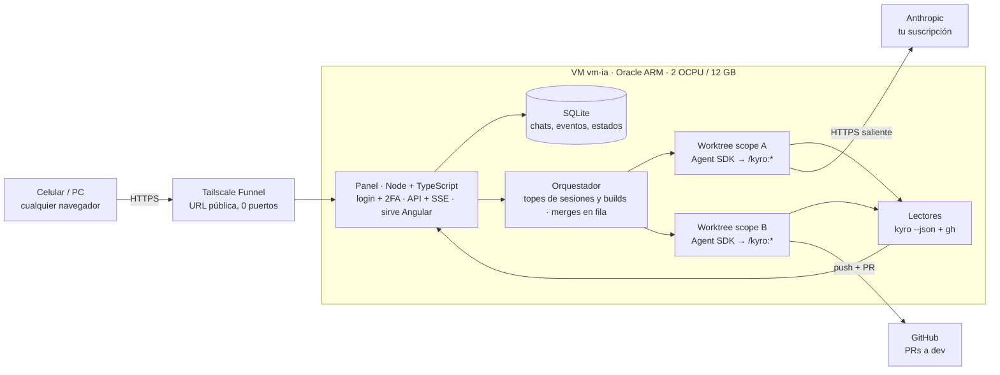

# agents-panel — Plan

_Última actualización: 3 de octubre de 2026 · Miqueas Gentile_

> Fuente de verdad del plan. Los estados de cada worktree están en [`estados.md`](estados.md).

## Resumen y decisiones

La v1 es un panel web que corre en la VM (`vm-ia`, Oracle). Desde ahí se le mandan pedidos a Claude Code, que trabaja con el mismo flujo Kyro de la PC (idea → forge → sprint → QA → `/merge-dev`). Cada scope o work corre en su propio worktree y el resultado son PRs a `dev`: vos las revisás y las aprobás.

| # | Tema | Decisión |
| --- | --- | --- |
| 1 | Motor | Solo Claude Code, vía Claude Agent SDK, con tu suscripción. OpenCode y Pi quedan fuera de la v1. |
| 2 | Acceso | **Tailscale Funnel**: URL pública con HTTPS, sin comprar dominio y sin abrir puertos en la VM. AWS obliga a abrir un puerto público. Cloudflare Tunnel necesita algún dominio con DNS en Cloudflare (no tiene que ser el de NovaGent). Queda para más adelante. |
| 3 | Unidad de trabajo | **1 scope o work de Kyro = 1 worktree.** Las tareas de un sprint corren una tras otra dentro del worktree, y lo que va en paralelo son scopes o works distintos. |
| 4 | Qué muestra la web | Historial de chats, worktrees activos y el estado de cada uno (Planificación → Ejecución → QA → PR a dev, con estado fino). |
| 5 | Impacto en skills | Cambios chicos. El que más se toca es `merge-dev`: pasa de dos máquinas a tres, el `origin` de fe/be pasa a GitHub y las preguntas al usuario van al panel. |
| 6 | Frontend | En la misma VM, servido por el backend. |
| 7 | Stack | Todo TypeScript: backend Node + Fastify + Agent SDK, frontend Angular. |
| 8 | Repo | `agents-panel`, separado de NovaGent. Es multiproyecto: la v1 arranca solo con NovaGent y después se suman Judiciar y otros. |

## Unidad de trabajo: un scope o work = un worktree

La unidad es un scope o un work de Kyro (`.agents/kyro/scopes/` o `.agents/kyro/work/`), no la tarea suelta. Los dos tienen sprints y se ejecutan igual.

- **Kyro ya lo hace así.** `kyro-sprint-executor` corre una tarea por vez y prohíbe paralelizar etapas. Dentro de un sprint, cada tarea depende del estado que dejó la anterior.
- **El scope o work ya define las ramas.** `merge-dev` espera `feature/<scope>` en la raíz y `feature-<scope>` en fe y be.
- **El estado de Kyro queda aislado.** `local.json` (scope activo) está en `.gitignore`, así que cada worktree tiene el suyo. Dos scopes o works no tocan los mismos archivos.

Cómo se arma un worktree en la VM:

1. En la raíz (NovaGent): `git worktree add ~/wt/<proyecto>/<slug> -b feature/<slug>` (el panel lo hace con `execFile`, sin shell; la raíz `~/wt` se cambia con `PANEL_WORKTREES_DIR`). Con varios proyectos la ruta pasó de `~/wt/<scope>` a `~/wt/<proyecto>/<slug>`.
2. Adentro, fe-ventas y be-ventas se clonan en la rama `feature-<scope>` (lógica de `scripts/orca-setup.sh`).
3. Se copian los `.env` de desarrollo de be-ventas y se instalan las dependencias (`go mod download`, `npm install`).
4. Arranca la sesión de Claude Code con `cwd` en el worktree y se corre `/kyro:forge`.

Resuelto con `scripts/panel-setup.sh` (repo `ventas`, ver `vm-setup.md` paso 10). El problema: `orca-setup.sh` clona fe y be desde la copia local, entonces su `origin` apunta a esa carpeta y no a GitHub. Así `merge-dev` no puede pushear ni abrir la PR. En la VM se clona desde GitHub con `--reference` a la copia local, para que siga siendo rápido.

## Varios proyectos y capacidad de la VM

Un proyecto quieto solo ocupa disco. Lo que consume CPU y RAM son los worktrees que trabajan al mismo tiempo. El cupo gratis es **2 OCPU y 12 GB**: Oracle lo redujo a la mitad desde el 15/06/2026 ([InfoQ](https://www.infoq.com/news/2026/07/oracle-cloud-free-tier-limits/)).

No hay un límite contratado de worktrees: es una **configuración del panel**. Cada sesión activa es un proceso de Claude Code, que usa poca RAM. Lo pesado son los builds y tests (`ng build`, `go test`), que compiten por los 2 núcleos.

- **Sesiones en paralelo:** 4 al arrancar (lo mismo que hoy con Orca en una PC de 8 GB). Se puede subir.
- **Builds y tests pesados en paralelo:** 2, con el resto en fila (`en_cola_build`).
- **Swap de 8 GB** como colchón.

| Recurso | VM actual (tope gratis) | Lo consume |
| --- | --- | --- |
| CPU | 2 OCPU | Builds y tests de los worktrees activos |
| RAM | 12 GB + 8 GB de swap | Un proceso de Claude Code por sesión, más cada build (Angular aprox. 3–4 GB, a medir) |
| Disco | 200 GB (tope gratis) | Repos, node_modules y caché de Go por worktree, aprox. 2–5 GB (a medir) |

Lo más probable es que se termine antes el límite de uso de la suscripción que la VM.

**Limpieza al mergear.** Cuando todas las PRs de un scope o work están mergeadas en `dev` y la raíz ya está en `main`, el panel borra el worktree solo:

1. Detecta el merge con `gh pr list --head feature-<scope> --state merged`.
2. Corre `git worktree remove ~/wt/<scope>` y borra las ramas locales `feature/<scope>` y `feature-<scope>`. Las remotas las borra GitHub si está activado "auto-delete head branches".
3. Archiva el chat: queda en el historial como solo lectura.

Si hay cambios sin commitear o una PR cerrada sin mergear, no borra nada y lo marca como `revisar`.

**Registro de proyectos.** Se hace desde el panel, no con un archivo en cada repo: la idea de un `.panel/project.yaml` por proyecto se descartó (el panel guarda la lista en su base y el setup es un comando por proyecto). El usuario pega `owner/repo` o una URL de GitHub en la pantalla **Proyectos** de la web y el panel lo da de alta (`POST /api/projects`, la misma API que usa la web):

- **Solo GitHub.** Entrada validada con `owner/repo` (owner de 1 a 39 caracteres alfanuméricos o guion; repo de hasta 100 con letras, dígitos, punto, guion o guion bajo, sin empezar con punto ni guion). Cualquier otra cosa (otros hosts, `file://`, SSH, credenciales, rutas) se rechaza con 400 antes de ejecutar nada. El clon es `gh repo clone <owner/repo> <destino>` por `execFile`, sin shell, con el `gh` autenticado de la VM.
- **Dónde se clona:** `<PANEL_PROJECTS_DIR>/<nombre>` (por defecto `~/proyectos`, donde ya viven `ventas` y `agents-panel`). El nombre interno es kebab-case, no cambia (se usa en rutas y worktrees) y sale del repo si no se pasa; además hay un **nombre visible** libre y editable (`display_name`).
- **Estados del proyecto:** `cloning` (clonando), `ready` (listo) y `error` (con el motivo en `status_detail`, recortado a 500 caracteres). El clon corre en segundo plano porque uno grande supera un timeout HTTP. Un proyecto pasa a `ready` solo si el clon terminó, su origin es el repo pedido y la rama base existe; si algo falla queda en `error` y se borra la carpeta que creó el panel. Un error se reintenta (`POST /api/projects/:id/retry`). Antes de clonar se exige espacio libre (`PANEL_MIN_FREE_DISK_GB`, por defecto 10); sin espacio queda en `error` «sin espacio». Al arrancar, los proyectos que estaban clonando pasan a `error` «interrumpido». Crear un chat sobre un proyecto que no está `ready` responde 409.
- **Carpeta que ya existe:** se adopta sin clonar si es la raíz de un repo git cuyo origin (https o ssh, con o sin `.git`) es el repo pedido; con otro origin responde 409 y no toca nada. Registrar dos veces el mismo repo responde «ya existe».
- **Setup:** si el repo trae `scripts/panel-setup.sh`, el detalle del proyecto sugiere `bash scripts/panel-setup.sh` (`suggestedSetupCommand`); nunca se aplica solo: el comando se guarda explícito y se edita después (`PATCH /api/projects/:id`).
- **Kyro:** si el repo trae `.agents/kyro/`, al quedar listo se corre `kyro install --scope workspace --init-workspace --yes` en él (hallazgos en `vm-setup.md`, paso 13); si no, el proyecto queda registrado con `hasKyro: false` y un aviso. Una falla de Kyro no revierte el proyecto: queda `ready` con `kyroWarning`.
- `project:add` del CLI sigue sirviendo para registrar una carpeta ya clonada (así se registró `novagent`).
- **Tipos de chat y proyectos sin Kyro:** hay tres tipos: `work`, `scope` y `direct` (**Pedido directo**). `direct` corre en su propio worktree y rama, pero el primer mensaje es el pedido tal cual, sin skill de Kyro. Un proyecto con `hasKyro: false` rechaza `work` y `scope` con 409 (nada se crea) y solo ofrece `direct`; con Kyro se ofrecen los tres. Los chats `direct` también leen el repo (`ls`, `cat`, `head`, `tail`, `wc`, `grep`, `pwd` como inicio de comando, solo con rutas dentro del worktree; sin variables, `~`, comodines, barras invertidas ni comillas dentro de una ruta, y sin opciones que lleven una ruta como `--file=/x`: bash las resolvería distinto de como las valida el panel): el agente nunca corre con `bypassPermissions`.
- **Inicializar Kyro** (`POST /api/projects/:id/kyro-init`, con TOTP): los archivos de Kyro solo llegan a los worktrees nuevos si están commiteados, así que no se instala en el clon base. El panel crea el worktree `<worktrees>/<proyecto>/kyro-init` en la rama `chore/kyro-init` desde la rama base, corre `kyro install --scope workspace --init-workspace --yes` ahí (bajo el mismo `KyroLock` que la actualización) y deja un commit `chore(kyro): inicializar Kyro` **sin pushear**. Las skills de Kyro son globales de la VM y no se copian por proyecto: después de cada `kyro install` del panel (esta acción y el alta de un proyecto con Kyro) se corre `scripts/vm/06-kyro-skills.sh`, que las enlaza en `~/.claude/skills` para que Claude Code las vea. El usuario revisa, pushea y mergea a la rama base; hasta entonces el proyecto sigue sin Kyro. Si algo falla no queda worktree ni rama. Responde 409 si el proyecto ya tiene Kyro, no está `ready`, hay una actualización de Kyro en curso, ya hay una inicialización en curso o ya existe la rama.
- **Traer cambios del clon base** (`POST /api/projects/:id/pull`, sin TOTP: solo avanza, no puede perder trabajo): `git fetch origin` y `git pull --ff-only origin <rama base>` por `execFile`. Responde `{ status: 'updated' | 'up_to_date', before, after, commits, ahead, output }`. Rechaza con 409, sin tocar nada, si el clon está en otra rama que la base, tiene cambios locales en archivos versionados (los no versionados no cuentan), divergió de `origin/<base>`, el proyecto no está `ready` o hay una actualización de Kyro en curso; 502 si git falla (red, origin sin la rama). Los commits locales que GitHub no tiene se conservan y se informan (`ahead`). Los worktrees existentes no se tocan.
- **Borrar un proyecto** (`DELETE /api/projects/:id`, body `{ name, code }`): pide el nombre del proyecto (el visible o el interno) y un TOTP nuevo (se verifica primero). Borra los worktrees (`<worktrees>/<proyecto>`), la carpeta del clon, los chats con sus eventos, los `.env` cifrados y el registro. **No borra nada y responde 409** si hay una sesión corriendo (`running`) o trabajo que existiría solo en la VM (`blockers`: `uncommitted` = cambios sin commitear o archivos nuevos no ignorados; `unpushed` = commits que ningún remoto contiene, incluso en ramas locales o con HEAD suelto), en el clon base, en cada worktree y en los repos anidados un nivel (los repos hijos de ventas). Lo que git ignora (los `.env` del panel) no cuenta. Una carpeta de clon que existe pero no es un repo git se rechaza con 409 (no se puede verificar). Una carpeta de clon que no es un directorio real hijo directo de `PANEL_PROJECTS_DIR` (un symlink, una carpeta adoptada de otro lugar) **no se borra**: se desregistra y se conserva (`cloneRemoved: false`). El registro se borra al final: si algo falla a la mitad responde 500 y el proyecto sigue registrado para reintentar. No toca GitHub. La verificación de «sin pushear» no hace `fetch`: un push hecho desde otra máquina y no traído se ve como pendiente, y se falla del lado seguro.

Los estados del proyecto son distintos de los estados de un worktree (ver [`estados.md`](estados.md)).

**`.env` de desarrollo por proyecto.** Cada proyecto puede tener uno o varios `.env` identificados por ruta relativa (`.env`, `.env.local`, `backend/.env`, `be-ventas/.env.local`…). Se suben, reemplazan y borran por la API (`/api/projects/:id/env`; desde la web, en la Configuración de la página del proyecto) y el panel los escribe en cada worktree nuevo. Un `.env` nunca vuelve al navegador:

- **Cifrado en reposo:** tabla `project_env_files` (`ciphertext`, `iv`, `tag`, `key_names`, `updated_at`, única por proyecto y ruta) con AES-256-GCM. La clave se deriva con HKDF-SHA256 de `PANEL_SECRET_KEY` con info `agents-panel:env-files-v1`, y el AAD es `<projectId>:<ruta>`: un cifrado copiado a otra fila no se descifra. Ni la base ni sus backups tienen el contenido en claro.
- **Solo metadatos hacia afuera:** las respuestas traen ruta, nombres de las claves, fecha y si es legible; nunca el contenido. El logger de Fastify redacta el campo `content` (`LOGGER_OPTIONS` en `apps/api/src/app.ts`, el mismo para `main.ts` y los tests) y un test de punta a punta busca un valor centinela en respuestas, logs, `chat_events` y los archivos de la base.
- **Validaciones (400, sin guardar nada):** ruta relativa con `/`, sin `..`, `.`, segmentos vacíos, `\`, NUL ni `.git`, de hasta 200 caracteres; el archivo se llama `.env` o `.env.<sufijo>` y se rechaza si contiene `prod` o termina en una plantilla (`example`, `sample`, `ejemplo`, `template`). El contenido tiene hasta 64 KB, sin NUL, finales LF o CRLF, y cada línea es vacía, comentario (`#`) o `CLAVE=valor` (con `export ` opcional); los valores multilínea entre comillas no se admiten. Los errores citan la línea por número, nunca su texto. Además git tiene que ignorar la ruta en el clon del proyecto (`git check-ignore`).
- **Re-autenticación:** subir, reemplazar o borrar exige, además de la sesión, un código TOTP vigente que no se haya usado (comparte el paso con el login). Sin código, incorrecto o repetido responde 401 `invalid_totp`, cuenta para el límite de intentos y queda en `login_attempts` con `step = 'reauth'`. No sirven los códigos de recuperación.
- **Escritura en worktrees:** al crear un chat, después del setup (que puede crear las carpetas, como los repos hijos de NovaGent), se escriben todos los `.env` del proyecto con modo 600. Antes de escribir el primero se revalida cada ruta, se exige que la carpeta exista y quede dentro del worktree (sin escaparse por symlinks) y que git la ignore; se escribe en un temporal y se renombra, así un symlink en el destino se reemplaza y no se sigue. Si algo falla, la creación responde 422 con el motivo y se deshace todo (worktree, rama y chat): el agente no arranca sin sus `.env`. El evento del chat registra solo las rutas.
- **Rotar `PANEL_SECRET_KEY`:** los `.env` ya guardados quedan ilegibles (`readable: false`), no se escribe ninguno en worktrees (crear un chat da 422) y hay que volver a subirlos.
- **Aplicar a los activos:** el PUT acepta `applyToActive: true` para escribir el archivo recién guardado en cada worktree activo del proyecto (chat cuyo worktree existe). El resultado viene por worktree (`written` o `skipped` con motivo) y uno que falla no frena a los demás; el guardado queda hecho igual. Un chat con el agente corriendo (`running`) se omite con el motivo «agente en curso: se aplica cuando termine o en el próximo chat»: así el agente no puede cambiar una carpeta por un symlink mientras se escribe (debt-6), sin agregar `O_NOFOLLOW` por carpeta.

**Versiones y actualización de Kyro.** Kyro es global de la VM (CLI en `~/.npm-global/bin/kyro`, runtime en `~/.agents/kyro/current`, skills enlazadas a `~/.claude/skills`), así que se actualiza desde una pantalla propia, no por proyecto. La API:

- `GET /api/versions` → `{ kyro: { installed, latest, updateRunning } }`. `installed` sale de `kyro --version` y `latest` de `npm view kyro-ai version` (ambos por `execFile`, con timeout de 5 s y 10 s). Sin red, con error o con una salida que no es semver el valor es `null` («última: desconocida»); la actualización sigue permitida.
- `POST /api/versions/kyro/update` con `{ "code": "<TOTP>" }`: exige sesión, CSRF y un código TOTP vigente que no se haya usado (mismo `ReauthVerifier` que los `.env`: sin código, incorrecto o repetido responde 401 `invalid_totp` y cuenta para el límite de intentos). Responde **202** `{ runId }` y sigue en segundo plano, o **409** `{ error, running }` si hay sesiones corriendo (con la cantidad) o ya hay otra actualización en curso.
- `GET /api/maintenance-runs?kind=kyro-update` → las últimas 50 corridas, la más nueva primero.
- **Sin sesiones corriendo (L8):** el bloqueo se toma en un solo paso síncrono (`AgentManager.tryBeginMaintenance`): no hay carrera entre «no hay sesiones» y «bloqueo puesto». Mientras dura la actualización, crear un chat o mandar un mensaje responde 409 («Kyro se está actualizando; probá de nuevo cuando termine»); el bloqueo se libera siempre al terminar, bien o mal.
- **Raíces con cambios locales:** la actualización global (`npm i -g kyro-ai@latest`, skills y `kyro doctor`) corre siempre. En cada raíz, si el repo tiene cambios locales (versionados o no) **fuera de `.agents/kyro/`**, el script no corre `kyro update` ahí: la saltea, lo cuenta en su salida y emite una línea `KYRO_SKIPPED=<raíz>` (antes de `KYRO_VERSION`). `GET /api/maintenance-runs` devuelve por corrida `skipped: [raíces]` y la pantalla Versiones lo muestra dentro de esa corrida. Una raíz salteada se actualiza en la próxima corrida, cuando esté limpia.
- **`project.json` modificado:** si el update deja `.agents/kyro/project.json` modificado en el clon, `GET /api/projects` y `/:id` traen `kyroPendingCommit: true` (se calcula al leer con `git status`, no se guarda) y la web muestra en la tarjeta y en la página del proyecto «Kyro actualizado en el clon: hay cambios por commitear». Se commitean con un work o con el botón Commit de un worktree, no a mano sobre el clon base. Esos cambios no bloquean **Traer cambios** (git sigue rechazando el pull si origin toca el mismo archivo), pero sí el **borrado** del proyecto, porque son trabajo sin commitear.
- **Qué corre:** `bash scripts/vm/08-kyro-update.sh <raíces>` por `execFile` (sin shell, timeout de 10 min), con las raíces de los proyectos `ready` que tienen `.agents/kyro/`. La ruta se cambia con `PANEL_KYRO_UPDATE_SCRIPT`. Un `KyroLock` (mutex) serializa la actualización con el `kyro install` del alta de proyectos: nunca se superponen.
- **Historial:** cada corrida es una fila de `maintenance_runs` con versión anterior, versión nueva, `running` / `ok` / `error` y la salida recortada a los últimos 16 KB. La versión nueva es la que se mide con `kyro --version` al terminar (con la línea `KYRO_VERSION=` del script como respaldo), no la pedida. Una corrida que quedó `running` por un reinicio del panel pasa a `error` («interrumpido») al arrancar.
- **H1 verificada (Kyro 6.1.0):** la secuencia correcta es `npm i -g kyro-ai@latest` y después `kyro update --yes` en cada raíz con Kyro; `--yes` no pide nada interactivo. Detalle en `vm-setup.md`, paso 14. La web lo expone en la pantalla **Versiones**.

**Pantallas web del scope `proyectos-y-versiones`.** La web sigue la identidad visual de [`identidad-visual.md`](identidad-visual.md) (Tailwind v4, tokens en un solo archivo, Inter). El header dice «Panel de agentes» y el menú tiene **Proyectos** (pantalla inicial) y **Versiones**.

- **Proyectos (`/`):** una tarjeta por proyecto con nombre visible, la URL completa de GitHub como link con su rama base, y el estado (Clonando / Listo / Error con el motivo) a la derecha del todo; aviso «proyecto sin Kyro» y Reintentar si falló. Se refresca cada 3 s solo mientras haya un clon en curso. El botón **Nuevo proyecto** abre un modal con el alta: pide la URL completa `https://github.com/usuario/repo` (con `/tree/<rama>` opcional, de donde sale la rama base), la valida en el cliente con la misma regla que la API (que sigue siendo la autoridad) y muestra el 400/409 del servidor dentro del modal sin borrar lo escrito. Cuando un proyecto queda listo sin setup guardado y el repo trae `scripts/panel-setup.sh`, la tarjeta muestra el setup sugerido con Confirmar / Editar / Sin setup: nada se guarda hasta confirmar.
- **Proyecto (`/projects/:id`):** un layout con un riel lateral **Chats** / **Configuración**. Sin hijo, abre el último chat elegido de ese proyecto (se recuerda por proyecto en el navegador, con la app funcionando igual si no hay almacenamiento) o, si no hay, **Nuevo chat**. Un id que no existe muestra «Proyecto no encontrado». El proyecto se relee cada 3 s mientras clona.
  - **Chats (`/projects/:id/chats`):** a la izquierda, arriba el botón **Nuevo chat** y debajo los chats del proyecto (`GET /api/chats?projectId=`) con título, `work|scope|directo · rama` y estado; el elegido queda resaltado y la lista se recarga al navegar y cada 4 s mientras haya un agente corriendo. `chats/new` es el formulario de nuevo chat con el proyecto fijo (deshabilitado con el motivo si no está listo; el servidor responde 409 igual); el selector de tipo ofrece Work, Scope y Pedido directo con Kyro y solo Pedido directo sin él, con un aviso y un enlace a Inicializar Kyro y `chats/:chatId` la conversación, con el streaming de siempre. `/chats/:id` sigue funcionando y redirige a su proyecto. Estado fino, fase y «te toca actuar» en la lista son del plan de ejecución automática, no de este scope.
  - **Configuración (`/projects/:id/settings/:tab`):** una pestaña a la vez, con la activa en la URL: **General** (nombre visible, rama base y comando de setup, y debajo la **zona de peligro** con Borrar proyecto: un modal que pide escribir el nombre y un código TOTP, y que lista los bloqueos si se rechaza), **Environment** (los `.env`) y **Repositorio** (Traer cambios de GitHub, que muestra el resultado o el motivo del rechazo, e Inicializar Kyro con modal TOTP, que muestra la rama creada). Agregar una pestaña es sumar una entrada en `settings-tabs.ts` y su caso en `settings.page.ts`.
- **`.env` en la web (pestaña Environment):** solo escritura. Se lista ruta, claves y fecha (o «ilegible», para volver a subirlo); se sube un archivo o texto pegado, se reemplaza subiendo a la misma ruta y se borra con confirmación. Cada acción pide un código TOTP nuevo en un **modal** (`TotpModal`: input de 6 dígitos, Enviar y cruz para cerrar) que no guarda el código: se vacía al enviar y al cerrar. Un 401 `invalid_totp` se muestra dentro del modal, que sigue abierto. El contenido vive solo en el formulario hasta enviarse y se descarta después; si el código fue incorrecto no se guardó nada y se conserva el borrador para reintentar solo con el código. Con «aplicar a los worktrees activos» se ve el resultado por worktree.
- **Versiones (`/versions`):** Kyro instalada y última publicada («última: desconocida» sin red). Actualizar es un icono de refresh (con `aria-label`) que abre el modal TOTP; gira y se deshabilita mientras dura la actualización; el 409 con la cantidad de sesiones corriendo se ve dentro del modal. La pantalla se refresca cada 3 s mientras actualiza y el historial muestra la salida desplegable.
- **Desplegar el panel (06/10/2026, work `pr-y-deploy`).** La pantalla Versiones suma la tarjeta **Panel**: commit con el que arrancó el servidor, commits de `origin/main` sin desplegar (`git fetch` cacheado 60 s) y el botón Desplegar (TOTP). `POST /api/versions/panel/deploy` corre `scripts/vm/12-panel-deploy.sh` (fast-forward de `main`, `npm ci` si cambió el lock, build; vuelta atrás si falla) con el candado de mantención, y si hubo commit nuevo la API se cierra con código 75 para que systemd la relance (`Restart=on-failure`; sin sudo). Se rechaza (409) fuera de systemd, con sesiones corriendo, con otra mantención o con un piloto en fase de merge. La corrida queda en `maintenance_runs` con `kind = 'panel-deploy'`. La web sigue el reinicio y pide refrescar cuando el servidor vuelve con otro commit. Desplegar otros proyectos queda fuera: sus credenciales de producción no van en la VM (su CI). Detalle en `vm-setup.md`, paso 18.
- **Sesión vencida vs. código incorrecto:** un 401 `unauthorized` lleva al login; un 401 `invalid_totp` se queda en la pantalla con «Código incorrecto o ya usado».

**Estructura del repo:** `apps/api` (Fastify + Agent SDK), `apps/web` (Angular), `packages/shared` (tipos compartidos).

## Funcionalidades del panel

**Chats** (como claude.ai)

- Lista de conversaciones con título, proyecto, scope, fecha y estado.
- Abrir una conversación muestra todo lo que pasó, incluidas las herramientas que usó el agente, y se puede seguir (`resume` con el `sessionId`).
- Un chat nuevo puede ser una **consulta libre** (sin worktree, solo lectura sobre `main`) o una **feature nueva**, que crea el scope o work y su worktree.
- Estos chats viven en la base del panel, no en el historial de la app de Claude.

**Worktrees activos**

- Una tarjeta por scope o work: proyecto, ramas, fase, **estado fino** con detalle (ver [`estados.md`](estados.md)), tarea n/m, último evento.
- Marca clara cuando **te toca actuar**: aclaración, permiso, aprobación de plan o de cierre, PR lista.
- Acciones: abrir el chat, pausar, cancelar, reanudar.

**Progreso por fase**

| Fase | De dónde sale |
| --- | --- |
| Planificación | `kyro context-pack --json` (`nextAction`: `plan_sprint`, `clarify`; en un Work, `kyro work status --json`: `plan_tasks`) |
| Ejecución | `nextAction`: `execute_task`, `review_task` (en un Work también `resolve_blocker`); avance = tareas con review `pass` / total |
| QA y cierre | `/kyro:qa`; `nextAction`: `qa_or_close` (en un Work, `ready_to_close`). Después del cierre, `plan_sprint` o `await_scope_completion` |
| PR a dev | `gh pr list --head feature-<scope> --json url,state,statusCheckRollup` |

Campos confirmados en la VM con Kyro 6.1.0 (05/10/2026, scope `autopiloto-kyro`, T1.2). Las fixtures reales están en `apps/api/test/fixtures/kyro/` (se regeneran con `capture.sh`) y las lee `apps/api/src/kyro/state.ts`; ver el detalle en [`estados.md`](estados.md#campos-reales-de-kyro-confirmados-en-la-vm).

## Servicio de acciones y paridad manual (scope `operaciones-worktree`)

**Decisión D26: lo que hace el piloto también se hace a mano, con el mismo código.** `WorktreeOps` (`apps/api/src/worktrees/ops.ts`) es el único servicio de acciones sobre un trabajo. El piloto (`Autopilot`, por `actions`) y las rutas de la API lo llaman con un **actor** (`user`, `pilot` o `agent`) y cada acción deja su entrada en el Timeline con ese actor (ver [`estados.md`](estados.md#operaciones-manuales-git-por-trabajo)).

- **Guardas por actor.** Las del actor `user`: se rechaza con 409 si el agente corre, hay mantenimiento de Kyro o el piloto está en `active`, `queued` o `waiting_quota`; para operar a mano se pausa el piloto. El piloto no pasa por esas guardas (es quien corre). El candado por chat (una operación a la vez, 409) vale para todos. Un trabajo `archivado` rechaza todo lo que escribe con 409.
- **Catálogo con su test.** `PARITY_CATALOG` (`packages/shared`) lista cada acción: id, quién la hace sola (`pilot` o nada), de qué tipo es (paso del agente o determinista) y su acceso manual (ruta o paso). `apps/api/test/parity-catalog.test.ts` falla si una acción del piloto no tiene acceso manual, si una ruta del catálogo no está registrada, si un paso del piloto o una llamada suya al servicio (`actions.<método>`) no está catalogada, y comprueba que el mismo push deja `pilot` y `user` en el Timeline. Sumar una fila nueva al piloto obliga a sumar su botón. Reparar Kyro queda como acción manual sin ruta.

**Rutas nuevas del sprint `paridad-manual-y-pr`.** Todas piden sesión; las `POST` piden además CSRF y `Origin`. Ninguna está en la allowlist pública. Errores comunes: 404 trabajo o repo que no existe, 400 entrada inválida (`repo` es `.` o una carpeta de primer nivel, nunca absoluto ni con `..`), 409 guarda del actor `user` o trabajo archivado, 422 git o `gh` rechazó.

| Ruta | Para qué | Guarda |
| --- | --- | --- |
| `POST /api/chats/:id/steps` `{ "step" }` | Pasos del agente: `plan`, `execute`, `qa`, `fix`, `close`, `merge_dev` (lanzan una sesión nueva con el mismo prompt y rol que usa el piloto) y `complete` (verbo de Kyro más commit de `.agents/kyro`) | Guardas de `user`; solo scope o work; `qa` solo en scope y corre `kyro analyze`; `merge_dev` exige `.claude/skills/merge-dev/SKILL.md`; deja «Paso pedido» en el Timeline |
| `GET /api/chats/:id/git/pr` | Vista previa de Crear PR: por repo con commits fuera de su base, su PR abierta si hay, título `feat(<slug>): <título>` y cuerpo desde los commits | Solo lectura; corre aunque el agente trabaje |
| `POST /api/chats/:id/git/pr` `{ "repos": [{ "repo", "title", "body" }] }` | Crear PR por repo: trae la base (un conflicto se aborta y se lista), busca secretos, pushea la rama sin `--force` y abre la PR hacia la base del repo o devuelve la ya abierta (el push la actualiza); sin validación (D25) | Guardas de `user`; los secretos frenan antes del push; resultado y link por repo en el Timeline |
| `GET /api/chats/:id/git/diff?repo&against=worktree\|base&file` | Ver cambios (D27): parches por repo, cortados por archivo (con `file` se trae uno entero, «ver más») | Solo lectura; nunca muestra archivos ignorados (los `.env`); `file` inválido o ignorado da 400 |
| `POST /api/chats/:id/git/discard` `{ "repo", "files" }` | Descartar los cambios de archivos elegidos (D28) | Guardas de `user`; rechaza con 400 rutas absolutas, con `..`, ignoradas o sin cambios y no toca nada |
| `GET /api/chats/:id/work/delete-preview` | Qué se perdería al borrar: por repo, rama, si existe en origin, commits sin pushear y archivos sin commitear | Solo lectura |
| `POST /api/chats/:id/work/delete` `{ "deleteRemote" }` | Borrar trabajo (D28): worktree y ramas locales; las remotas solo con `deleteRemote: true`; nunca la base | Guardas de `user`; apaga el piloto antes de tocar nada; pasa por `limpiando` a `archivado`; si falla a mitad queda en `revisar` con lo hecho |

- **Correr merge-dev.** En un proyecto con la skill `merge-dev`, el botón principal es el paso `merge_dev` (lanza al agente con la skill, que hace los pasos propios del proyecto: versión y merge de la raíz). Crear PR es el camino genérico para el resto.
- **Rutas que ya existían y quedaron en el catálogo.** `git`, `git/commit`, `git/pull-base`, `git/pull-branch`, `git/push`, `setup`, `idea` (aprobar la idea y crear el scope) y `messages` (resolver los conflictos del merge pidiéndoselo al agente).
- **Actor en el servicio.** Los métodos que usa el piloto (`pushBranch`, `commitKyro`, `openPr`) y los manuales reciben el actor y lo copian al Timeline y a las transiciones.

### Indicador de uso de los proveedores (D24)

El uso de la cuenta activa se ve desde un icono del header en todas las pantallas (`apps/web/src/app/usage/`). Muestra el porcentaje de la ventana de 5 h con su tono (un guion si no hay dato); al abrirlo (popover en escritorio, hoja inferior en celular) muestra una barra por ventana (5 h, semanal y las semanales por modelo si vienen) con porcentaje, hora local de reinicio, «actualizado hace X» y un aviso discreto cuando el dato está degradado. Se recarga al iniciar, al cambiar de cuenta y cada 3 minutos con la pestaña visible (sin saltar la caché de la API).

- **Tabla `provider_usage` (migración 21).** Guarda la **última observación** por cuenta, proveedor y ventana (`account_id`, `provider` = `claude`, `window`: `five_hour`, `seven_day`, `seven_day_opus`, `seven_day_sonnet` u otra que informe el SDK; `utilization` 0-100 o `NULL`, `status` `allowed` / `allowed_warning` / `rejected` o `NULL`, `resets_at`, `source` `event` o `query`, `observed_at`). Índice único por `(account_id, provider, window)`. El uso se mide por `account_id`, nunca para todo el panel junto (ver «Cuentas de Claude» en `CLAUDE.md`).
- **Fuente pasiva (ADR-0002).** Cada `rate_limit_event` de cualquier sesión se guarda con el `account_id` de esa sesión (`AgentManager`); un fallo al guardar no corta el turno.
- **Fuente a pedido.** `UsageService` (`apps/api/src/usage/`) abre una sesión corta del SDK **sin prompt** con la cuenta (su `CLAUDE_CONFIG_DIR`, o la variable quitada para la principal) y lee la llamada experimental de uso (`usage_EXPERIMENTAL_MAY_CHANGE_DO_NOT_RELY_ON_THIS_API_YET`); guarda con `source = query` y cierra siempre la sesión. **Caché de 60 s** por cuenta, **una sola lectura en vuelo por cuenta** (las demás esperan la misma promesa) y timeout de 20 s. El lector del SDK se inyecta, así que los tests usan fixtures.
- **Degradado, nunca roto (ADR-0015).** Si la llamada no existe, falla, tarda de más o dice que no hay límites del plan, la respuesta es el dato guardado con `degraded: true`, el `error` recortado y `observedAt` para mostrar su antigüedad; sin datos, `windows` vacío y `degraded: true`. Nunca un 500.
- **`GET /api/usage`.** Cuenta activa; exige sesión, **no pide CSRF** porque no muta nada, y no está en la allowlist pública. `?refresh=1` salta la caché de 60 s. Responde `ProviderUsage` (`provider`, `accountId`, `windows` con su `tone`, `source`, `observedAt`, `degraded`, `error?`).
- **Tono (`usageTone`, en `packages/shared`).** `ok` por debajo de 70 %, `warn` desde 70 %, `danger` desde 90 % o con `status = rejected`; sin porcentaje, `allowed_warning` es `warn`. La API y la web usan la misma función, así que el umbral no se duplica.
- **El piloto retoma por `resetsAt` (ADR-0016).** Un límite de uso deja `sin_cupo_de_uso` y el piloto reintenta a `resetsAt + 60 s` (`QUOTA_RESET_MARGIN_MS`): el `resetsAt` sale del `rate_limit_event` rechazado de la sesión o, si no vino, de la ventana rechazada guardada en `provider_usage` para la cuenta de la última sesión del run (nunca de otra cuenta). Sin `resetsAt` futuro vuelve a los **15 minutos** de antes (`QUOTA_RETRY_MS`). El Timeline muestra la hora de retomada (UTC) y el `retryAt` guardado sirve para rearmar tras un reinicio.

### Web de operaciones (D18, D19, D20, D23)

Criterios de UI de D23: los de [`identidad-visual.md`](identidad-visual.md#criterios-de-pantallas) (anatomía de tarjetas, un solo badge por entidad, color según quién actúa, confirmación `danger` que nombra lo que se pierde, operaciones largas con indicador y botón deshabilitado, acciones no disponibles deshabilitadas con el motivo escrito, estados vacíos con texto y celular primero).

- **Sin sección «Worktrees» (D18).** La sidebar **Chats** es la lista de trabajos (chat ↔ worktree 1:1) y se filtra con **Activos · Te toca · Terminados · Todos** (`chats/chat-filter-logic.ts`, función pura con spec). El mapeo (ADR-0013) usa `WORKTREE_STATE_INFO[state].who` del estado fino: `working` o `waiting` → Activos; `user` o `error` → Te toca; `ok` → Terminados. Una consulta o pedido directo, sin estado fino, usa el estado de la sesión: `running` → Activos; `error` o `interrupted` → Te toca; `idle` o `cancelled` → Terminados. Todos muestra todo. Cada filtro muestra su cantidad, el elegido se recuerda en `localStorage` y uno sin chats muestra un texto vacío propio.
- **Pestaña Git por trabajo (D19, D26).** Está en todo chat con worktree. Una **tarjeta por repo** (raíz e hijos) con rama, base, archivos cambiados y adelante/atrás, y sus botones: Ver cambios, Commit (modal con los archivos a elegir y aviso, no bloqueo, si el mensaje no es Conventional Commits), Descartar (confirmación `danger` que nombra cada archivo), Traer base, Traer mi rama y Push; en la barra de la pestaña, Reinstalar dependencias, Crear PR (título y cuerpo editables por repo, link de la PR existente, archivos con posibles secretos; en proyectos con `merge-dev` el botón principal es Correr merge-dev) y Borrar trabajo (vista previa de ramas, commits sin pushear y archivos sin commitear, y casilla para borrar también las ramas remotas). Los **pasos del agente** (Planificar, Ejecutar, QA, Corregir, Cerrar, Completar) se leen de `PARITY_CATALOG` (`stepButtons`, solo los que aplican al tipo de chat: `qa` solo en scope y `merge_dev` solo con la skill), así que una acción nueva del piloto con su acceso manual aparece sola. Mientras el agente corre, el piloto está `active`, `queued` o `waiting_quota` o el trabajo está archivado, **todos los botones se ven deshabilitados con el motivo escrito** (`gitBlockedReason`; el 409 de la API se muestra con el suyo). Una operación a la vez, con indicador. El resultado va por repo con la salida recortada; un pull con conflicto lista los archivos y ofrece «Pedírselo al agente», que manda el mensaje por la ruta de mensajes. Un trabajo archivado queda de solo lectura.
- **Configuración → Repositorio (D20, ADR-0014).** Lista los repos del proyecto (raíz e hijos, `project_repos`) con su **rama base editable**, **Detectar repos** y el **pull del clon base con el resultado en la fila de cada repo** (actualizado con cuántos commits trajo, sin cambios, o rechazado con el motivo: cambios locales o divergencia). Si el pull falla en la raíz (409 o 502), la API manda igual `repos` con lo que pasó en cada uno y la web lo muestra por fila junto al error (ADR-0017). El clon base solo se actualiza: la pantalla no ofrece commit ni instalación.

## Arquitectura



- **Backend Node + TypeScript** (Fastify). Se autentica con tu suscripción mediante `claude setup-token`.
- **Una sesión por scope o work:** `query()` del SDK con `cwd` en el worktree y `settingSources: ['project', 'user']` (carga `CLAUDE.md`, `.claude/agents` y las skills, incluidas las `kyro-*`). `permissionMode: 'acceptEdits'` más una lista de comandos permitidos (git, gh, go, npm, kyro).
- **Permisos y preguntas:** las herramientas fuera de la lista se deniegan y quedan como evento `permission_denied` (aprobar con botones es de la etapa 5). Las **preguntas del agente** (`AskUserQuestion`) sí llegan al panel: se guardan en `pending_questions`, se responden desde la web con botones o texto libre y la respuesta vuelve a la misma sesión por `updatedInput` (detalle en la etapa 4; estado `esperando_respuesta` en [`estados.md`](estados.md)).
- **Cuentas de Claude:** el panel puede correr con cualquiera de los logins de Claude Code de la VM (tabla `claude_accounts`: nombre y directorio de config; la migración 19 crea la principal, `~/.claude`, sin directorio). Hay **una cuenta activa para todo el panel**, que se elige con el desplegable del encabezado o en **Cuentas**; cada turno nuevo la lee al arrancar y pasa al SDK `env` con `CLAUDE_CONFIG_DIR` de la cuenta. Para la principal la variable se **quita** (no se pone `~/.claude`: Claude Code buscaría `.claude.json` adentro de la carpeta en vez de `~/.claude.json`). Un turno en curso termina con su cuenta. `agent_sessions.account_id` y el evento `session_started` (`account`) registran con qué cuenta corrió cada sesión: es la base para medir tokens por cuenta. Las cuentas extra comparten `projects/`, skills y `settings.json` con `~/.claude` (`scripts/vm/11-claude-cuentas.sh`, paso 17 de [`vm-setup.md`](vm-setup.md)), así un chat empezado con una cuenta se retoma con la otra; la web avisa si una cuenta no tiene login o no está enlazada, y no deja activar una sin login. Rutas: `GET/POST /api/accounts`, `PATCH/DELETE /api/accounts/:id`, `PUT /api/accounts/active` (con sesión y CSRF; la principal y la activa no se borran).
- **Hooks** `PreToolUse` / `PostToolUse`: clasifican los comandos para el estado fino y hacen esperar los builds en el semáforo.
- **Eventos:** cada mensaje del SDK se guarda en SQLite y se manda por SSE.
- **Frontend Angular** (standalone + signals). Lo compila y sirve el backend.
- **SQLite con `node:sqlite`** (módulo nativo de Node 24, `DatabaseSync`): evita módulos nativos de compilación en ARM. WAL y `foreign_keys=ON` siempre activos; migraciones numeradas en código (`apps/api/src/db/migrations.ts`, tabla `schema_migrations`).
- **Ubicación de la base:** fuera del repo, en `PANEL_DATA_DIR` (por defecto `~/.local/share/agents-panel`, archivo `panel.sqlite`, directorio con permisos 0700). Configuración por entorno en `apps/api/src/config.ts`; si falta `PANEL_SECRET_KEY` (mínimo 32 bytes) o `PANEL_ORIGIN`, el proceso no arranca y nunca imprime valores secretos.

## Acceso y despliegue

Se publica con **Tailscale Funnel**. Entrás desde cualquier navegador a `https://vm-ia.<tu-red>.ts.net`, sin instalar nada en la PC ni en el celular. La VM no abre ningún puerto.

| Opción | Qué se instala | URL | Puertos abiertos | Veredicto |
| --- | --- | --- | --- | --- |
| **Tailscale Funnel** | Tailscale solo en la VM | `https://vm-ia.<tu-red>.ts.net` | Ninguno | **v1** |
| Cloudflare Tunnel + Access | `cloudflared` solo en la VM | Dominio tuyo con DNS en Cloudflare | Ninguno | Más adelante, si querés dominio propio |
| Tailscale privado | Tailscale en VM, PC y celular | Solo tus dispositivos | Ninguno | Descartada: obliga a instalar apps |
| AWS (API Gateway / CloudFront) | — | Dominio en AWS | 443 abierto | Descartada |

**Cómo funciona Funnel:** Tailscale en la VM abre una conexión saliente. Los servidores de Tailscale pasan el tráfico cifrado a la VM y el TLS se resuelve en la propia VM. Requisitos: MagicDNS y certificados HTTPS activados, y el atributo `funnel` en la política de acceso. Puertos admitidos: 443, 8443 y 10000. Está en beta y tiene un límite de ancho de banda no configurable ([docs](https://tailscale.com/kb/1223/funnel)).

**Como la URL es pública, el login es la única puerta:**

- Contraseña con hash Argon2id y **segundo factor obligatorio** (passkey o TOTP).
- Sin registro público: el usuario se crea por CLI en la VM.
- Cookie de sesión `HttpOnly`, `Secure`, `SameSite=Strict`, vencimiento corto y protección CSRF.
- Límite de intentos por IP y usuario, bloqueo temporal y registro de logins.
- Cabeceras de seguridad (CSP, HSTS). Ninguna ruta de la API sin sesión.

**Servicio:** systemd (`agents-panel.service`), escucha solo en `127.0.0.1:3000`. Funnel lo publica con `tailscale funnel --bg 3000`.

### Allowlist pública de la API

Guard global deny-by-default (`apps/api/src/auth/guard.ts`): toda petición, incluso a rutas inexistentes, devuelve 401 sin sesión válida, salvo las rutas con `config: { public: true }`. La lista pública es exactamente esta y un test recorre las rutas registradas para atrapar rutas nuevas:

| Ruta | Por qué es pública |
| --- | --- |
| `GET /api/health` | Chequeo de salud (no devuelve datos del usuario) |
| `POST /api/auth/login` | Paso 1 del login (contraseña) |
| `POST /api/auth/totp` | Paso 2 del login (segundo factor; exige la cookie de desafío) |

Sesión: cookie `__Host-panel_session` (HttpOnly, Secure, SameSite=Strict, Path=/), token opaco de 32 bytes; en la base solo su SHA-256. Vence a los 30 min de inactividad o a las 12 h absolutas (configurable).

## Impacto en las skills actuales de NovaGent

| Pieza | ¿Cambia? | Qué hacer |
| --- | --- | --- |
| `merge-dev` | Sí, poco | (1) Tres máquinas: PC, VM y la otra; `pull --no-rebase` y nunca `--force`. (2) `origin` de fe/be = GitHub. (3) "Restaurar rama" no aplica en worktree. (4) Los casos que frenan llegan al panel como "esperando tu respuesta". |
| Merge de la raíz a `main` | Sí (panel) | El panel serializa los merges de la raíz (`en_cola_merge_raiz`). |
| `orca.yaml` + `orca-setup.sh` | Sí | En la VM, el panel usa una versión que recibe el scope, nombra ramas `feature-<scope>` y clona desde GitHub con `--reference`. |
| Kyro (`kyro-ai`) | Sí: pasa a v6 | `npm i -g kyro-ai@latest` + `kyro install --agent claude`. En v6 el plugin de Claude Code se retiró: el CLI proyecta las skills `kyro-*` en `~/.claude/skills/`. La v6 trae los arreglos de Windows, así que los parches de `KYRO_README.md` dejan de hacer falta. |
| Stubs `kyro-forge`, `kyro-qa` y plugin `kyro-ai` | Se retiran | Con v6 se usan las skills que proyecta `kyro install --agent claude`. Desinstalar el plugin viejo después de verificar. |
| `kyro-sprint-executor` | No | Solo necesita el CLI `kyro`. |
| `git-committer` (`~/.claude/agents/`) | Copiar | Está solo en tu PC. |
| `.opencode/skills/git-commit` | Mover (opcional) | `merge-dev` lo lee; conviene llevarlo a `.claude/skills/`. |

## Etapas de implementación

1. ✅ **Preparar la VM** (cerrada el 03/10/2026, ver [`vm-setup.md`](vm-setup.md)). Node, Go (versión de `go.mod`), `gh`, Kyro 6, Claude Code + `kyro install --agent claude`, `git-committer`, swap. Clonar NovaGent con fe y be, `.env` de desarrollo. _Listo cuando:_ `kyro doctor`, `go test ./...` y el build de `client` pasan.
2. ✅ **Probar a mano** (03/10/2026: work `fix-employee-test-redundant-or` lanzado desde el celular con Remote Control, terminó en PR a `dev`. Hizo falta configurar permisos: ver `vm-setup.md` paso 6). Un scope chico de punta a punta con `claude` en `tmux`, en un worktree. _Listo cuando:_ las PRs a `dev` quedan bien y la raíz mergeada a `main`.
3. **Ajustar las skills** de NovaGent (`merge-dev`, script de worktree). _Listo cuando:_ el paso 2 sale sin intervención.
4. **Panel MVP.** Login + 2FA, crear scope (worktree + sesión SDK), streaming, historial y resume. _Estado (04/10/2026):_ implementado en el scope `panel-mvp`, sprint 1; el recorrido de punta a punta de la API se probó en la VM (ver `vm-setup.md` paso 10). Falta confirmar las pantallas en un navegador. Decisiones del sprint:
   - **Segundo factor = TOTP** con 10 códigos de recuperación; passkey queda para después. Los usuarios se crean solo por CLI.
   - **Permisos del agente:** `acceptEdits` + `allowedTools` para `Bash(git|gh|npm|go|kyro)`; `canUseTool` niega lo demás (escritura solo dentro del worktree, lectura del worktree y `~/.agents`) y lo guarda como evento `permission_denied`. Nunca modo sin permisos. Aprobar con botones es de la etapa 5.
   - **Tope fijo de 4 sesiones** a la vez (la quinta da 409); el tope configurable es de la etapa 6.
   - **Kyro en la sesión:** el SDK no registra `/kyro:forge` ni `/kyro:work` en la VM (ver deuda), así que el primer mensaje manda al agente a leer la skill `kyro-forge` o `kyro-work` de `~/.agents/skills`. Instalar las skills para Claude (`kyro install --agent claude`) permitiría usar los comandos directos.
   - **Preguntas del agente desde la web (05/10/2026, scope `autopiloto-kyro`, sprint 1 `preguntas-web`; plan en [`.agents/kyro/plan/2026-10-04-autopiloto-kyro.md`](../.agents/kyro/plan/2026-10-04-autopiloto-kyro.md)):** el agente puede preguntar y vos respondés desde el chat. `AskUserQuestion` pasa el hook `PreToolUse` sin decidir y `AgentManager` la resuelve en `canUseTool`: guarda la pregunta (`pending_questions`, migración 7), publica `question_asked`, espera **sin timeout ni respuesta automática** (L5) y devuelve la respuesta como `updatedInput` (método confirmado por el spike H1, abajo). Rutas `GET /api/chats/:id/questions` y `POST /api/chats/:id/questions/:qid/answer` (404 si la pregunta no es del chat, 409 si ya fue respondida o cancelada, 400 si no coincide con las opciones; `answered_by` es el usuario de la sesión). Las dos exigen sesión y CSRF y **la allowlist pública no cambia**. Cancelar el trabajo, terminar el turno o reiniciar el panel cancelan lo pendiente. La web muestra la tarjeta con un botón por opción y «Otra respuesta». Los spikes de abajo son el respaldo de estas decisiones; los campos reales de Kyro están en [`estados.md`](estados.md#campos-reales-de-kyro-confirmados-en-la-vm).
   - **Spike H1 (05/10/2026, scope `autopiloto-kyro`, SDK 0.3.289):** `apps/api/scripts/spike-ask-question.ts` confirma en la VM que el agente puede preguntar con `AskUserQuestion` y que la respuesta vuelve a la misma sesión por **`updatedInput`** de `canUseTool` (`{ ...input, answers: { <texto de la pregunta>: <respuesta> } }`), con el hook `PreToolUse` dejando pasar la herramienta (devuelve `{}`, no deniega). La alternativa (denegar con `el usuario respondió: …`) también funciona, pero queda solo como respaldo: el método elegido es `updatedInput`. Además `model` en `query()` se respeta: `system:init` informó `claude-opus-5-5` y `claude-sonnet-5-5` según lo pedido.
   - **Spike H2 (05/10/2026, scope `autopiloto-kyro`, SDK 0.3.289, modelo `claude-sonnet-5-5`):** `apps/api/scripts/spike-forge-policy.ts` abre en un repo temporal una sesión real con el primer prompt del panel (`buildInitialPrompt('scope', …)`: leer la skill `kyro-forge`), los permisos reales del panel (`acceptEdits` + `decide()`) y la política de abajo. **Resultado: confirmada.** En 15 turnos el agente leyó la skill y `forge.md`, pidió el `context-pack`, ejecutó la tarea (`hola.txt`), corrió la validación, registró evidencia con `kyro record-evidence`, hizo el review con `kyro review --verdict pass --yes` y se detuvo en `qa_or_close` (`context-pack` final) sin llamar nunca a `AskUserQuestion`. No se usó `kyro-sprint-executor` ni `bypassPermissions`.
     - **Gates que preguntaron:** ninguno en el tramo ejecución → `qa_or_close`. Los gates de **QA, cierre de sprint, reglas globales y scope completo no se ejercitaron** (la política manda parar en `qa_or_close`): se prueban en el sprint 3 con el orquestador, y R16 sigue exigiendo que un gate no cubierto termine en pregunta.
     - **Control sin política** (mismo prompt, sin el bloque de política): tampoco preguntó, pero ejecutó, registró la evidencia y **se detuvo en `review_task`** diciendo que faltaba el review. O sea, lo que la política agrega de verdad es la **autorización a hacer el review en la misma sesión** y la orden de **parar en `qa_or_close`** en lugar de ofrecer QA o cierre. Para el sprint 3: la política tiene que decir explícitamente quién hace el review.
     - **Llamadas que la política de permisos del panel denegó** (el agente se adaptó solo, sin bloquearse): `cat ~/…` (la `~` no se admite en comandos de lectura), redirecciones (`>`, `2>&1` con otro destino) y `echo`. Conviene que la política le pida usar rutas absolutas y no encadenar con `echo`. Además el agente corrió `kyro repair integrity prepare` por su cuenta (es solo vista previa); la política del sprint 3 debe prohibir `kyro repair … apply` (R20: la reparación no se aplica sola).
     - **Salidas de `context-pack` observadas:** `execute_task` al arrancar (sprint planificado con una tarea) y `qa_or_close` al terminar; con el control, `review_task` tras el `record-evidence`. Coinciden con las fixtures de `estados.md`.
     - **Texto de política probado** (va como bloque al final del primer prompt; está en `POLICY_DRAFT` del script):

       ```text
       Autopilot policy (the user pre-approved the routine Kyro gates; follow it instead of asking):
       - Work only on the next task that "kyro context-pack --kyro-scope <scope> --json" routes. Follow its nextAction.
       - Execute the task, run its validations, record evidence with "kyro record-evidence" and review with "kyro review" through the CLI. Never edit sprint.json or any Kyro state by hand.
       - Do NOT ask the user for confirmation at routine gates. Do not ask which task to do, whether to review, or whether to continue.
       - When nextAction is qa_or_close: stop here and report it. Do not close the sprint and do not run QA in this session.
       - Ask the user (AskUserQuestion) only for a material product decision, a cost, or when Kyro reports clarify or a blocker you cannot resolve. Never guess on those.
       - Do not commit and do not push. Never use sudo, ssh, oci, tailscale or terraform.
       ```
   - **Piloto automático: bucle y política (05/10/2026, scope `autopiloto-kyro`, sprint 3 `orquestador-politica`).** `apps/api/src/pilot/`: `decide.ts` (`decideNextStep`, función pura que elige el paso solo con las señales de Kyro; el texto del agente no es una entrada), `policy.ts` (política de gates versionada, `POLICY_VERSION`, un bloque por paso: plan, ejecución, cierre; un gate que no conoce termina en pregunta, y borrar archivos es `git rm`/`git clean`, nunca `rm`), `prompts.ts` (primer mensaje de cada sesión con la skill, el contexto de `context-pack --task` y la política) y `autopilot.ts` (el servicio). Cada paso abre una **sesión SDK nueva** (`freshSession`, sin `resume`): el plan con el modelo pensante; la ejecución hasta `qa_or_close`, un paso `fix` si `kyro analyze` trae CRITICAL o HIGH, y el cierre (kyro-qa, deuda, commit, `close-sprint`) con el ejecutor. Si el cierre cierra el sprint sin haber invocado `kyro-qa` queda `bloqueado` con `qa_sin_correr`. Desde la política v2 (sprint 4) la sesión de cierre guarda el informe en `.agents/kyro/qa/<scope>/sprint-<n>.md` con primera línea `Verdict: <VEREDICTO>` antes de `kyro close-sprint`; el piloto lo lee (ruta fija, sin symlinks, dentro del worktree) y si falta o no es APPROVED / APPROVED WITH NOTES frena con `qa_sin_aprobar`. Antes de cada paso se exige que `kyro capabilities --json` traiga `record-evidence`, `review`, `close-sprint`, `analyze` y `context-pack`. Frenos con motivo: `sin_avance`, `tope_de_sesiones` (`PILOT_MAX_SESSIONS_PER_SPRINT`, 6 por defecto), `kyro_bloqueado`, `integridad_kyro`, `tarea_bloqueada`, `qa_sin_correr`; con las 4 sesiones ocupadas el trabajo espera `en_cola`; un rate limit rechazado deja `sin_cupo_de_uso` y reintenta a los 15 minutos. Pausar no corta el turno en curso (no abre el siguiente) y apagar deja el chat en modo manual. Las transiciones del piloto llevan actor `pilot`, paso, rol, modelo y versión de política. Nunca toca `permissionMode`. Rutas: `GET`/`POST /api/chats/:id/autopilot` y `autopilot: true` en `POST /api/chats` (sesión y CSRF). El cierre del scope o work, el push, el merge y la PR llegan en el sprint 4 (más abajo).
   - **Chat de tipo Idea (05/10/2026, sprint 4 `idea-cierre-merge`, T2.1).** `ChatKind` suma `idea` (migración 13 `chats_kind_idea`, que reconstruye `chats` conservando filas, ids y modelos). `POST /api/chats` con `kind: 'idea'` exige un proyecto con Kyro (409 si no) y rechaza `autopilot: true` (400: el piloto se prende al aprobar el plan); arranca un primer turno con el modelo pensante, la skill `kyro-idea` por ruta y el bloque de política `idea` (confirmar solo el docType y la ruta, preguntar únicamente huecos materiales, no crear scope ni work). El estado arranca en `madurando_idea` con actor `user` y se queda ahí al terminar el turno (no hay scope que leer). El piloto rechaza una idea (404) hasta que se apruebe su plan.
     - **D3 actualizada (decisión del usuario, 05/10/2026):** antes, ejecución + QA + deuda + commit + cierre corrían en **una sola sesión** del ejecutor. Ahora la **sesión de ejecución termina en `qa_or_close`** y el cierre es **otra sesión nueva del ejecutor** (kyro-qa, deuda, commit, `close-sprint`). Entre las dos, el panel corre `kyro analyze` y, si trae CRITICAL o HIGH, abre un paso `fix` antes de cerrar. Motivo: QA y cierre arrancan con contexto limpio (más independencia que en una sesión larga) y el gate de calidad lo decide el panel, no el agente. El plan de cada sprint sigue siendo del pensante. El prompt de cada sesión **lo arma el panel** con `context-pack --task` (mismos datos que `kyro-task-context`), no lo escribe la sesión anterior: es determinista y se prueba con fixtures.
     - **Retoma tras reinicio:** al arrancar (`onReady`, después de marcar `interrumpido` los chats que corrían) `Autopilot.resumeAll()` retoma cada run `active`: si el paso tenía una sesión SDK abierta la reanuda con `resume` y un prompt corto de continuación (cuenta como sesión del sprint, así que reinicios repetidos terminan en `tope_de_sesiones`); sin sesión abierta vuelve a decidir desde Kyro. `paused` y `off` no se retoman, y un run `waiting_quota` respeta su `retry_at`. Hasta tener el servicio systemd (etapa 6), cerrar la terminal donde corre el panel lo corta: usar `tmux` (ver `panel-desarrollo.md`).
     - **Qué no hace todavía:** push, pull de la base, PR, merge, frenos de merge (conflicto, build roto, secretos), el aviso Web Push y la web del piloto: sprints 4 a 6.
   - **Modelos por rol y permisos por proyecto (05/10/2026, scope `autopiloto-kyro`, sprint 2 `modelos-estado-permisos`).**
     - **Modelos:** cada trabajo usa un modelo **pensante** (idea, plan, plan de cada sprint) y uno **ejecutor** (ejecución, QA, correcciones, cierre). Catálogo por proveedor en `packages/shared` (`MODEL_CATALOG`; hoy solo `claude`: `claude-opus-5-5`, `claude-sonnet-5-5`, `claude-fable-5-1`, `claude-haiku-4-5-20251001`) y defecto global pensante `claude-opus-5-5` / ejecutor `claude-sonnet-5-5`. La configuración del proyecto (`GET`/`PUT /api/projects/:id/models`, con sesión y CSRF, sin TOTP porque no expone secretos ni cambia costos) guarda proveedor y modelos; `NULL` significa «el defecto». `POST /api/chats` acepta `models: { thinker?, executor? }`. Al crear el chat se **resuelven y se guardan** (override del chat > proyecto > defecto) en `chats.provider/thinker_model/executor_model`, así que cambiar el proyecto después no mueve un trabajo en curso. Un modelo o proveedor fuera del catálogo da 400 y no guarda nada. La pestaña Modelos y el selector del chat nuevo están en la web desde el sprint 5.
     - **Sesión por rol:** `AgentRunner.run` recibe `model` y `role`; `SdkRunner` arma las opciones en `buildQueryOptions` (pura, `permissionMode: 'acceptEdits'`, nunca `bypassPermissions`). `AgentManager.start(chatId, text, { role })` abre una fila de `agent_sessions`, registra `session_started { role, provider, model }` y la cierra con el resultado; `model_mismatch` si `system:init` informa otro modelo. **Regla provisoria de los turnos manuales** hasta que el piloto elija el rol por paso (sprint 3): el primer turno de un chat scope o work (INIT o plan) usa el pensante; los siguientes y los pedidos directos, el ejecutor.
     - **Permisos de Bash por proyecto:** la base (`git`, `gh`, `npm`, `go`, `kyro`, `du`, `df`, `free` y los comandos de lectura con ruta validada) no cambia (`du`, `df` y `free` se sumaron el 06/10/2026, work `comandos-base`: solo leen uso de disco y memoria; un extra guardado que después pasó a la base deja de mostrarse como extra, así el proyecto puede seguir guardando su lista). Cada proyecto puede sumar **comandos** (nombres simples, sin rutas, espacios ni metacaracteres; nunca uno de la base ni uno denegado) y **hosts de curl** desde `GET`/`PUT /api/projects/:id/permissions` (sesión, CSRF y **TOTP**, porque amplía lo que el agente puede ejecutar). Lista fija de **denegados** que ninguna configuración habilita: `oci`, `tailscale`, `terraform`, `sudo`, `su`, `ssh`, `scp`, `sftp`, `nc`, `ncat`, `socat`, `wget` (protege la regla de costos), más los **envoltorios** que ejecutan el comando que reciben (`bash`, `sh`, `env`, `xargs`, `nohup`, `timeout`, `time`, `watch`…, lista `COMMAND_RUNNERS`): el control solo ve la primera palabra de cada etapa, así que habilitar `env` volvería permitido `env sudo …`. Una configuración vieja que ya los tenga guardados tampoco los habilita. `curl` está siempre en modo restringido y nunca entre los auto-aprobados: solo GET/HEAD, URL `http`/`https` sin credenciales, solo a `localhost`, `127.0.0.1` o un host del proyecto, con una lista cerrada de opciones (sin `-L`, `-d`, `-F`, `-T`, `-X`, `-o`, `-O`, `-K` ni `@archivo`). Las sugerencias salen de los nombres de archivo del clon base (`uv.lock` o `pyproject.toml` → `uv`, `python`, `pytest`; `Makefile` → `make`; `Cargo.toml` → `cargo`) y nunca se aplican solas. El `AgentManager` carga los extras del proyecto en cada turno. Además, la base tiene **reglas por argumento** que cierran los caminos directos de una línea hacia los denegados (`checkBaseArgs`): `npm` deniega `exec`, `x`, `explore`, `edit` y cualquier `script-shell` (flag o `npm config set`); `git` deniega la opción global `-c`, `--config-env` y `--exec-path`, deja `git config` solo de lectura (`--get`, `--get-all`, `--get-regexp`, `--list`, `-l`; sin escrituras ni alias `!`), y deniega `--upload-pack`, `--receive-pack`, `--exec`, URLs `ext::`, `rebase --exec`, `bisect run`, `submodule foreach` y `filter-branch`; `go` deniega `generate`, `-exec`, `-toolexec`, `-vettool` y `go env -w/-u`. Una asignación de variable al principio (`GIT_SSH_COMMAND=… git push`) ya se deniega por primera palabra. Cada denegación explica el motivo para que el agente se adapte, y `npm ci/install/test/run`, `git status/diff/log/add/commit/push/pull/fetch/checkout/switch/branch/worktree`, `go build/test/vet/run`, `gh` y `kyro` siguen permitidos. La lista no es un sandbox: `npm test`, `go run`/`go test` y `python` ejecutan código del repo (el plan lo acepta), pero ya no hay un camino directo de una línea a un denegado fijo. El objetivo de la configuración es que ningún denegado se habilite **por nombre**. La tab Permisos de la web (Configuración del proyecto) se entregó en el sprint 2.
     - **Estado fino y Timeline:** tablas `worktree_state`, `worktree_transitions` y `agent_sessions`, lector de Kyro y mapeo de `nextAction` a estado; el detalle está en [`estados.md`](estados.md) («Cómo lo implementa el panel»).
5. **Estados y PRs.** Estado fino ([`estados.md`](estados.md)), stepper, PRs y checks, aprobaciones con botones.
6. **Operación.** ✅ Tailscale Funnel (paso 15 de `vm-setup.md`) y ✅ servicio systemd con el build de producción (paso 16, sprint 6 de `autopiloto-kyro`, 06/10/2026). Siguen pendientes: backup de SQLite, topes configurables y limpieza automática (el scope `operaciones-worktree` no los cubrió; solo sumó el borrado manual de un trabajo).
7. **Después de la v1.** Notificaciones push (PWA), consumo por scope, Cloudflare si querés dominio propio, Judiciar.

## Riesgos

- **Límite de uso:** el panel, tus chats y Claude Code en la PC consumen el mismo límite. Anthropic pausó un cambio que daría créditos aparte al Agent SDK y podría retomarlo ([fuente](https://support.claude.com/en/articles/15036540-use-the-agent-sdk-with-your-claude-plan)).
- **CPU y memoria:** con 2 OCPU y 12 GB, los builds van en fila y hay swap. El panel mide RAM y CPU para ajustar topes.
- **Oracle puede reclamar la VM** si pasa 7 días con muy poco uso.
- **Secretos:** en la VM solo `.env` de desarrollo. Nada de credenciales de AWS de producción ni el backup de `EcommerceTable`.
- **El panel ejecuta código:** URL pública → segundo factor obligatorio, límite de intentos y permisos acotados (sin `bypassPermissions`).
- **Conflictos en la raíz:** PC y VM pueden mergear `main` a la vez; se cubre con `pull --no-rebase` y la fila de merges.

**Si se reinicia la VM:** worktrees, base del panel y sesiones de Claude Code (`~/.claude/projects`) están en disco y no se pierden. Lo que estaba corriendo pasa a `interrumpido` y se reanuda con `resume`. Solo se pierde todo si se termina la instancia y se borra el disco; para eso están los push a GitHub y un backup del volumen.

## Pendientes

- [x] Acceso: Tailscale Funnel.
- [x] Stack: todo TypeScript.
- [x] Repo: `agents-panel`.
- [x] Kyro en agents-panel: sí. Work para cambios chicos, Forge (scope) para cada etapa grande.
- [x] Revisar en la VM la salida JSON de `kyro status`, `kyro context-pack` y `kyro work status` para cerrar el mapeo de fases (05/10/2026, ver `estados.md`).
   - **Plan de la idea escrito (05/10/2026, T2.2).** Después de cada turno de un chat Idea el tracker busca el documento de `kyro-idea` por git (`apps/api/src/chats/idea.ts`: `git status --porcelain -z -uall` y `git diff` contra la base, por `execFile`; nunca el texto del agente): archivos `.md` nuevos o cambiados en `.agents/kyro/<docType>/` sin contar `scopes/`, `work/`, `trace/` ni `qa/`. Exactamente uno, y sin pregunta pendiente, deja `esperando_aprobacion_plan` con la ruta en el detalle y en `data.path` de la transición; ninguno deja `madurando_idea`; varios dejan `bloqueado` (`otro`) con las rutas. Un mensaje nuevo del usuario vuelve a `madurando_idea`. `GET /api/chats/:id/idea` (sesión obligatoria) devuelve `{ state, path, documents, content, truncated }`; la lectura exige archivo regular dentro del worktree, sin symlinks y hasta 256 KB.
   - **Aprobación del plan de una idea (05/10/2026, T2.3).** `POST /api/chats/:id/idea` con `{ action: 'approve_scope' | 'approve_work' | 'request_changes', text? }` (sesión y CSRF), solo desde `esperando_aprobacion_plan` (409 si no; `apps/api/src/chats/idea-actions.ts`). `approve_work` corre `kyro work create --id <slug> --from <ruta> --by <usuario> --json` por `execFile` en el worktree; si Kyro lo rechaza el chat sigue siendo idea y queda `bloqueado` (`kyro_bloqueado`) con el error. Si sale bien, `chats.kind` pasa a `work`, se crea el run del piloto y este abre `plan_tasks` con el pensante. `approve_scope` pasa `kind` a `scope` y crea el run con `seed_path` (el documento): como el scope todavía no existe en Kyro, el piloto abre un paso **`init`** (sesión nueva, pensante, `kyro-forge` en modo INIT sobre el documento, política de plan) y después sigue el bucle normal (`plan_sprint` del sprint 1); si tras `init` Kyro sigue sin scope, frena con `kyro_bloqueado`. `request_changes` exige texto y lo manda como turno nuevo del pensante en la misma sesión; el estado vuelve a `madurando_idea`. Cada decisión es una entrada del Timeline con actor `user`, `data.{action, path, userId, username}`. Migración 14 (`pilot_step_init`): el CHECK de `step` admite `init` en `agent_sessions` y `autopilot_runs`, y esta suma `seed_path`.
   - **Cierre del scope o work por el panel (05/10/2026, T3.1).** `decideNextStep` suma la decisión `{ kind: 'complete' }`: `await_scope_completion` sin sprint abierto y con `openDebt` 0, o un work en `ready_to_close`. Si queda deuda abierta frena **una vez** en `esperando_aprobacion_cierre` y la lista (id, título, prioridad, leída del `debt[]` de `sprint.json`) queda en `data.debt` de la entrada del Timeline (`TransitionInput.record` fuerza la entrada aunque el estado se repita). Completar lo hace el panel, no el agente: `kyro scope complete --kyro-scope <scope> --yes` o `kyro work close --work <slug> --outcome completed --reason … --expect-revision <n> --by pilot --yes --json` (`KyroReader.completeScope` / `closeWork`, por `execFile`), y commitea solo `.agents/kyro/` con `chore(kyro): completar scope <scope>` / `cerrar work <slug>` (`pilot/git-ops.ts`, `git add -- .agents/kyro` y `git commit -- .agents/kyro`, nunca `-A`). Un fallo de Kyro frena con `kyro_bloqueado` y uno de git con `git`. Mientras tanto el estado es `cerrando`; al terminar el run queda `finished` y el trabajo `terminado` (la fase de merge, T4.5, se suma entre ambos).
   - **Completar aceptando la deuda (05/10/2026, T3.2).** `POST /api/chats/:id/autopilot` con `{ action: 'accept_debt', reason }` (sesión y CSRF; `apps/api/src/pilot/accept-debt.ts`): solo para un scope en `esperando_aprobacion_cierre` (409 si no, 400 sin motivo). El panel corre `kyro scope complete --kyro-scope <scope> --accept-open-debt --reason <motivo> --yes`, commitea `.agents/kyro/` (`chore(kyro): completar scope <scope> aceptando deuda`), deja en el Timeline una entrada con actor `user` y `data.{userId, username, reason, debt}` (la deuda aceptada), y retoma el piloto, que ya no vuelve a preguntar por esa deuda porque el scope quedó completado. Si Kyro lo rechaza responde 422 y no cambia nada; si falla el commit queda `bloqueado` (`git`).
   - **Validación del proyecto: `validate_command` (05/10/2026, T4.1).** Columna opcional `projects.validate_command` (migración 15), igual que `setup_command`: se edita por `PATCH /api/projects/:id` (`validateCommand`, string o `null`, máximo 500; una comilla sin cerrar da 400) y viene en `GET`. `apps/api/src/worktrees/validate.ts` la parte con `splitCommand` y la corre **sin shell** por `execFile` dentro del worktree, con timeout (`PILOT_VALIDATE_TIMEOUT_MINUTES`, 15 por defecto); devuelve `passed`, `failed` (código de salida), `timeout` o `skipped` (sin comando) y nunca tira. La salida se recorta a los últimos 8000 caracteres para guardarla en el evento. El campo está en la web desde el sprint 5 (Configuración → General).
   - **Push de la rama (05/10/2026, T4.2).** Después de un paso `close` que cerró el sprint (y de que el QA quedó aprobado), el panel comprueba con `git rev-parse` que HEAD tiene un commit nuevo respecto de la marca tomada antes de la sesión y que la rama base local no se movió; si no, frena con `git`. Después corre `git push -u origin <rama>` por `execFile` (`pilot/git-ops.ts`; `pushArgs` solo acepta un nombre de rama simple: nunca `--force`, `--force-with-lease`, `+refspec` ni opciones, y no hay rebase). Lo mismo tras completar el scope (con o sin aceptar deuda) y tras `kyro work close`. Un push rechazado (remoto adelantado) o un worktree sin remoto deja `bloqueado` con `git` y la salida de git, sin reintentar. Cada push deja un evento `git_push` en el chat.
   - **Búsqueda de secretos (05/10/2026, T4.3).** `apps/api/src/pilot/secrets.ts`: `scanSecrets(diff)` es pura y mira solo las líneas **agregadas** de un diff y los nombres de archivo que agrega o cambia (`.env` y `.env.*` salvo `.env.example`, `*.pem`, `*.key`, `id_rsa*`, `id_ed25519*`, `credentials.json`; contenido: `BEGIN … PRIVATE KEY`, `ghp_`/`github_pat_`, `sk-ant-`, `AKIA…`, `xox[abpr]-`). Devuelve archivo y tipo, nunca el valor, y `describeSecrets` arma el detalle del freno con solo archivos y tipos. `scanWorktreeSecrets(cwd, base)` junta `git diff origin/<base>...HEAD`, lo pendiente (`git diff HEAD`) y los archivos sin trackear que git no ignora. El merge la corre antes del push final y frena con `blockedReason` `secretos` (T4.4 y T4.5).
   - **Merge genérico hacia la base (05/10/2026, T4.4).** `apps/api/src/pilot/merge.ts` (`runGenericMerge`), para proyectos sin `merge-dev`, con estados del Timeline `trayendo_dev` → (`resolviendo_conflictos`) → `validando_post_merge` → `abriendo_pr` → `pr_lista`. Pasos: commitea lo pendiente salvo que `scanWorktreeSecrets` lo marque; `git pull --no-rebase --no-edit origin <base>` (`pull` de `git-ops.ts`; nunca rebase ni force, y `pushArgs` solo empuja la rama del trabajo, nunca la base); si quedan rutas sin mergear (`git diff --diff-filter=U`) o `MERGE_HEAD`, abre una sesión `merge` con el ejecutor (`buildMergePrompt` + bloque de política `merge`: resolver lo mecánico, `git add` y `git commit --no-edit`; si un hunk tiene lógica de los dos lados, `AskUserQuestion` con los dos lados y esperar; nunca `git merge --abort`, push, rebase ni `--force`, ni mergear la PR) y al terminar verifica que no queden rutas sin mergear ni merge abierto, o frena con `conflicto`. Si el pull trajo commits y el proyecto tiene `validate_command`, lo corre (la salida recortada queda en el evento `validation`): si falla frena con `build_roto` y no hay PR; sin comando queda anotado en el Timeline que no hubo validación. Después `scanWorktreeSecrets` (`secretos`), push y PR: reusa la PR abierta de la rama (`gh pr list --head <rama> --base <base> --state open --json url`) o corre `gh pr create --base <base> --head <rama> --title … --body-file …` (`github-cli.ts`, inyectable, con el cuerpo en un archivo temporal). La URL queda en el Timeline (`pr_lista`) y, desde la migración 16 (`pilot_merge_phase`), `autopilot_runs` suma `phase` y `pr_urls` y los pasos `merge` y `merge_dev`. Motivos de freno nuevos: `conflicto`, `build_roto`, `secretos`, `merge_sin_pr`. El bucle que invoca esta fase es T4.5.
   - **Fase de merge en el bucle (05/10/2026, T4.5).** Al completar el scope o cerrar el work (T3.1, T3.2) el run pasa a `phase = 'merge'` (columna de `autopilot_runs`, migración 16) y el bucle la retoma tras un reinicio sin abrir ninguna sesión de Kyro. `pilot/merge-phase.ts`: si el worktree trae `.claude/skills/merge-dev/SKILL.md` el piloto abre una sesión `merge_dev` con el ejecutor (`buildMergeDevPrompt`: lee esa skill para el scope; política `merge_dev`: nada de `git merge --abort`, rebase, force ni mergear la PR; la skill sí puede pushear la rama del trabajo); si no, corre el merge genérico de T4.4 (sesión `merge` solo ante conflictos). Antes de terminar corre `scanWorktreeSecrets` sobre la raíz y cada repo hijo (carpetas de primer nivel con `.git`). Señal de éxito del merge-dev: la raíz quedó en `origin/<base>` (`git merge-base --is-ancestor`) o hay una PR abierta de la rama; se juntan las PR abiertas de la raíz y de los hijos con `gh pr list --head <rama> --state open --json url` (rama actual de cada hijo). Sin ninguna señal frena con `merge_sin_pr`. La URL (o URLs) queda en `autopilot_runs.pr_urls` y en el Timeline (`pr_lista`, o `mergeada` si no hubo PR); el cuerpo de la PR genérica sale de `sprint.json` (título, objetivo y sprints cerrados). El run termina `finished` con la PR lista; mergearla no es del panel.
   - **El tope de sesiones cuenta las sesiones sin avance (06/10/2026, work `tope-sesiones`).** Una sesión de ejecución hace una sola tarea, así que un sprint de 8 tareas frenaba con `tope_de_sesiones` aunque cada sesión hubiera avanzado (chat 3 de `operaciones-worktree`, sprints 1 y 2). Ahora el contador del sprint (`sessions_in_sprint`) vuelve a empezar cuando la sesión anterior fue una ejecución que cerró una tarea (`completedTask` en `decide.ts`: `tasksDone` subió entre la lectura de Kyro al empezar esa sesión y la de ahora); lo aplican igual `decideNextStep` y `beginSession`. Las sesiones `fix` y las reanudadas tras un reinicio no lo reinician, así que un bucle de correcciones o de reinicios se sigue cortando. `PILOT_MAX_SESSIONS_PER_SPRINT` (6) pasa a significar «sesiones seguidas sin cerrar una tarea».
   - **Menos bloqueos falsos (06/10/2026, work `menos-bloqueos`).** (1) El chequeo de QA del cierre (`usedSkill`) cuenta la herramienta `Skill` con `kyro-qa` y también un `Read` de `…/skills/kyro-qa/SKILL.md`, que es como el prompt del piloto manda usar la skill; antes un cierre con QA aprobado frenaba con `qa_sin_correr`. (2) `checkBash` respeta las comillas: enmascara el texto entre comillas simples y dobles (y lo escapado con `\`, como bash) antes de buscar `|`, `;`, `&`, saltos de línea, `<` y `>`, y valida cada etapa con su texto original. Así pasan `git grep -E "a|b"`, `git commit -m "… <email>"` y cuerpos de PR con varias líneas. Siguen rechazados `$(…)` y backticks (también entre comillas dobles, donde bash los ejecuta), una comilla sin cerrar y `$'…'`.
   - **Reanudar desbloquea (06/10/2026, work `piloto-reanudar`).** Reanudar o encender el piloto es la señal de que la persona resolvió lo que lo frenaba. Si en la primera decisión después de eso un work está en `resolve_blocker`, el piloto corre `kyro work unblock --work <w> --task <nextTaskId> --expect-revision <n> --by user`, lo deja en el Timeline («Reanudado por el usuario: el piloto desbloqueó Wn en Kyro», con el motivo anterior) y abre la sesión de ejecución con ese motivo en el prompt. Es una sola vez por Reanudar: si el agente vuelve a bloquear la tarea, el piloto frena con `tarea_bloqueada`. Si Kyro rechaza el unblock, frena con `kyro_bloqueado`. Los scopes no tienen `unblock` en Kyro y siguen frenando. Además, el `context-pack` de un scope lleva `--task <id>` solo cuando Kyro tiene próxima tarea: en el cierre (`qa_or_close`) `--task` sin id fallaba con «No next task in handoff» y el piloto frenaba en cada Reanudar.
   - **PR de un work terminado (06/10/2026, work `pr-y-deploy`).** Si el agente cierra el work y abre la PR por su cuenta (por ejemplo, retomado con un mensaje), `pr_urls` queda vacío y el estado en `terminado`. `GET /api/chats/:id/pr` devuelve las PR guardadas o, para un work en `terminado`/`pr_lista` sin PR guardada, las de la rama según `gh pr list --head <rama> --state all --json url` (en el worktree o en el clon del proyecto) y las guarda en la corrida del piloto si existe. La web pide esa ruta al abrir el chat y muestra la tarjeta de la PR en `pr_lista` siempre y en `terminado` solo si hay link. Si `gh` falla la lista sale vacía.
   - **Tipo Idea en Nuevo chat (05/10/2026, T5.1).** `chat-kinds.ts` ofrece Idea junto a Work, Scope y Pedido directo solo si el proyecto tiene Kyro, con una descripción de cada tipo bajo el select; el formulario no manda nunca `autopilot` (`newChatInput`): la idea prende el piloto al aprobar el plan. `GET /api/chats` y `GET /api/chats/:id` suman `workState` (el estado fino, `null` para un pedido directo) y la sidebar muestra un único badge por chat con la etiqueta del estado y el tono de quién actúa (`work-state.ts`: ámbar cuando te toca a vos, p. ej. «Esperando aprobación del plan»; acento mientras el agente trabaja, como «Madurando la idea»), o el estado de la sesión si no hay estado fino.
   - **Aprobación del plan, deuda y PR en la web (05/10/2026, T5.2).** En `chat.page` una tarjeta según el estado del trabajo (`approval-logic.ts`, con spec): con una idea en `esperando_aprobacion_plan`, el plan (`GET /api/chats/:id/idea`, Markdown convertido a datos y mostrado por interpolación: un `<script>` del documento se ve como texto) y tres acciones, Aprobar como scope, Aprobar como work y Pedir cambios (con un textarea obligatorio); con un scope en `esperando_aprobacion_cierre`, la lista de deuda abierta (leída del Timeline) y Completar aceptando la deuda (con motivo obligatorio); en `pr_lista`, los links https de la PR (`run.prUrls`). Los botones se deshabilitan con el motivo a la vista mientras la llamada corre. Las llamadas pasan por el interceptor de CSRF y la página relee el estado cuando llega un evento `state_changed`.
   - **Resumen del sprint 4 `idea-cierre-merge` y lo que queda (05/10/2026).** Un trabajo puede empezar como **Idea** desde la web (tres acciones sobre el plan: aprobar como scope, aprobar como work o pedir cambios) y, aprobado, el piloto lo lleva solo hasta la PR: planifica con el pensante, ejecuta con el ejecutor, **pushea la rama tras cada cierre de sprint**, **completa el scope o cierra el work él mismo** (frenando una vez si queda deuda, que solo se acepta con tu OK y un motivo), trae la base con `git pull --no-rebase`, resuelve los conflictos mecánicos con una sesión `merge` (lo de lógica es una pregunta), valida con el `validate_command` del proyecto, **busca secretos** en el diff y abre la PR con el `merge-dev` del proyecto o con el merge genérico. Nunca mergea la PR, nunca fuerza un push y nunca hace rebase. La **política de gates** es la versión 2 (`POLICY_VERSION`): la sesión de cierre guarda el informe de QA en `.agents/kyro/qa/<scope>/sprint-<n>.md` con `Verdict: <VEREDICTO>` en la primera línea y el piloto lo verifica (`qa_sin_aprobar`); además de los bloques `plan`, `execute` y `close` hay bloques `idea`, `merge` y `merge_dev`. Los frenos nuevos son `qa_sin_aprobar`, `secretos`, `conflicto`, `build_roto` y `merge_sin_pr` (más `git`, que ahora sí se escribe). **Queda para el sprint 5:** la web del piloto (interruptor, pausar y reanudar, selector de modelos, campo `validate_command`, preguntas con botones en toda la pantalla, el stepper por fases y el estado en las tarjetas) y las notificaciones Web Push (H3). **Queda para el sprint 6:** el `merge-dev` de ventas con versión, la verificación con una corrida real y el cierre del scope. Fuera de alcance de todo el scope: mergear la PR, los estados de PR (`pr_checks_fallidos`, `pr_cambios_pedidos`, `en_cola_merge_raiz`, `mergeando_raiz`), la limpieza del worktree y el `sin_cupo_de_uso` con la hora exacta de reinicio.
   - **Política v3: reglas sin preguntar (06/10/2026, sprint 6).** Cuando Kyro pregunta si una regla o aprendizaje es solo del scope o también global, el piloto no frena: toma la opción que Kyro recomienda (solo del scope si no recomienda ninguna), la registra con `kyro rule add` (con `--global` solo si es la recomendada), deja un ADR por regla y cierra el informe final con la sección «Reglas agregadas» (texto y si es scope o global). Antes (v2) registraba siempre solo para el scope y solo en ejecución y cierre; ahora la cláusula `global_rule` también vale en planificación. La política solo rige las sesiones del piloto: un chat manual sigue preguntando.
   - **`rm` con ruta validada y política v4 (06/10/2026, sprint 6, debt-5).** La base de Bash del agente suma `rm` como los comandos de lectura pero más estricto (`checkRm` en `apps/api/src/agent/permissions.ts`): cada operando se resuelve con `realpath` del directorio padre (siguiendo symlinks) sin seguir el último componente, y tiene que quedar dentro del worktree, no ser su raíz ni `.git` ni algo dentro de un `.git`. Solo se aceptan `-f`, `-r`, `-R` y `--`; se deniegan cualquier otra opción, globs, `~`, variables, sustituciones, redirecciones, comillas dentro de la ruta y segmentos `..` (un `a/link/..` lo resuelve distinto el shell que una revisión léxica). `rm` después de un `cd` se deniega (la ruta relativa ya no es la del worktree) y vale aunque el proyecto lo haya agregado como comando extra; un proyecto no puede configurarlo. Envoltorios (`env`, `xargs`, `nohup`, `timeout`, `sh -c`) siguen denegados (convención sec-1). La política del piloto pasa a v4: `git rm` para lo versionado y `git clean -f` o `rm` validado para lo no versionado, con su límite. Límite conocido: la validación es previa a la ejecución (no hay bloqueo contra un symlink creado entre ambas).
   - **Versión de be-ventas en merge-dev: entrega de R19 (06/10/2026, sprint 6).** Se hizo como Kyro Work (`version-merge-dev`) con Claude Code directo en el repo `ventas`, en la rama `feature/version-merge-dev`: **PR https://github.com/Maiki02/NovaGent/pull/1** hacia `main` (pendiente de revisión; no se mergea desde acá). Trae `scripts/version-bump.sh` (calcula major, minor o patch con los commits de `origin/dev..rama` sin merges, partiendo de la versión de `origin/dev` y después de traerla; commit `chore(version)` solo en be-ventas, sin commits propios no toca nada, repetirlo no vuelve a subir), `scripts/version-bump.test.sh` (S20: feat, fix, merge sin be-ventas, breaking, base en dev, idempotencia) y el paso en `.claude/skills/merge-dev/SKILL.md`. No se corrió merge-dev de verdad ni se tocó `dev` de be-ventas (sigue en `1.13.0`); agents-panel y judiciar no suben versión. El efecto real se ve la primera vez que se use merge-dev tras mergear la PR.
   - **Resumen del sprint 6 `docs-ventas-cierre` (06/10/2026).** **Producción:** la API sirve la web compilada (`@fastify/static`, `PANEL_WEB_DIR`, fallback SPA por el not-found handler, así que la allowlist pública sigue en tres rutas; cache largo solo con hash; CSP `style-src` con estilos en línea y el build sin CSS crítico en línea) y un candado `panel.lock` impide dos APIs sobre la misma base. El panel corre como servicio systemd (`agents-panel`, `127.0.0.1:3000`) y Funnel publica ese puerto (`scripts/vm/10-panel-service.sh`, paso 16 de `vm-setup.md`). **Piloto:** política v3 (ante «¿regla del scope o global?» toma la recomendada de Kyro y la informa en «Reglas agregadas») y v4 (`rm` validado); el prompt del primer turno de un Work da la ruta legible de la guía y prohíbe archivos sueltos. **Deuda menor del sprint 5:** ref de `chore/kyro-init` sin lanzar git, respaldo de `question_cancelled` una sola vez (`app_flags`, migración 18), tope de 10 dispositivos push, mensaje de «ya terminó», tests del sender y del service worker (con un bypass `/\host` cerrado). **ventas:** el paso de `ProjectVersion` en `merge-dev` (PR https://github.com/Maiki02/NovaGent/pull/1, sin mergear). **No se hizo:** la corrida real del piloto en test-panel con el servicio (pregunta con botón, retoma tras reiniciar el servicio, avisos push en PC y Android, suscripción vencida) quedó diferida por el usuario y está como deuda abierta (`debt-1`, `debt-10`, `debt-12` a `debt-15`); la guía está en `panel-desarrollo.md`. Mergear la PR desde el panel, el backup de SQLite, los topes configurables y la limpieza siguen fuera del alcance de este scope.
   - **Scope `operaciones-worktree` (decisión D31): implementado (06 y 07/10/2026).** Las decisiones que `autopiloto-kyro` dejó fuera quedaron en este scope: pestaña Git del worktree con commit, traer base, push y reinstalar dependencias (D19, D22), Pull por repo del proyecto (D20), indicador de uso (D24), Crear PR (D25), paridad manual de todo lo que hace el piloto (D26), ver cambios (D27), descartar y borrar trabajo (D28) y la ausencia de una sección «Worktrees» (D18). Quedan descritas en la idea (`.agents/kyro/plan/2026-10-04-autopiloto-kyro.md`) y, tal como se implementaron, en «Servicio de acciones y paridad manual», «Indicador de uso» y «Web de operaciones» de este doc. El cierre del scope y la verificación con un recorrido manual en ventas siguen el sprint 4 (`docs-y-cierre`).
   - **El piloto encuentra el scope o work del chat por su nombre (06/10/2026, Work `read-work-por-chat`).** Antes `readWork` exigía una sola carpeta en `.agents/kyro/work` (agents-panel ya tenía dos commiteadas: cualquier Work con piloto frenaba con «hay 2») y `readScope` dependía de `local.json`, que está en `.gitignore` y no viaja en un worktree. Ahora el scope es el que se llama como el chat (slug) si existe su `sprint.json` y si no `activeScope`; el work es la carpeta con el nombre del slug o la única creada desde la fecha del chat (`createdAt` de `work.json`). Las llamadas sin slug ni fecha se comportan como antes. Cómo se usa: [`panel-desarrollo.md`](panel-desarrollo.md), «Continuar un scope o work que ya existe».
   - **Repos del proyecto y operaciones git por trabajo (06/10/2026, scope `operaciones-worktree`, sprint 1 `repos-y-git-por-trabajo`).** Qué hace: la API conoce los repos de cada proyecto y ofrece, por trabajo, las operaciones git manuales con el mismo servicio que usa el piloto (D19, D20, D22, D26). Qué no hace todavía: la web (pestaña Git y Repositorio, sprint 3), Crear PR, ver cambios, descartar y borrar trabajo.
     - **`project_repos` (migración 20).** Una fila por repo del proyecto con `path` (`.` para la raíz o una carpeta de primer nivel) y `base_branch` editable; la migración siembra la raíz de los proyectos ya registrados. Los hijos son las carpetas de primer nivel que son repos git y que la raíz ignora (ventas: raíz en `main`, `fe-ventas` y `be-ventas` en `dev`). Se detectan al quedar `ready` un proyecto nuevo (best effort: un fallo no rompe el alta) o con `POST /api/projects/:id/repos/detect`; `GET /api/projects/:id/repos` los lista y `PATCH /api/projects/:id/repos/:repoId` edita la base. Cambiar la base del proyecto actualiza la fila raíz.
     - **Pull del clon base por repo.** `POST /api/projects/:id/pull` actualiza cada repo en su propia base con `pull --ff-only` (rechaza cambios locales o divergencia) y responde los campos de `PullResult` de la raíz más `repos` con el resultado o el error de cada uno (ADR-0005). Si falla la raíz se lanza su error (409 o 502) después de actualizar los hijos. El clon base solo se actualiza: nunca se commitea, pushea ni instala en él.
     - **Rutas git por trabajo** (`apps/api/src/chats/git-routes.ts`, servicio `apps/api/src/worktrees/ops.ts`): `GET /api/chats/:id/git` (estado por repo: rama, archivos, adelante y atrás), `POST /api/chats/:id/git/commit` (`{ repo, files, message }`), `POST /api/chats/:id/git/pull-base` y `/git/pull-branch` (`{ repo? }`), `POST /api/chats/:id/git/push` (`{ repo? }`) y `POST /api/chats/:id/setup` (reinstala dependencias). Todas con sesión y las `POST` con CSRF; la allowlist pública sigue en tres rutas (guard test). El cuerpo se valida con el esquema de Fastify: `repo` es un path relativo (`.` o una carpeta de primer nivel, sin `/`, `\` ni `..`) que además tiene que coincidir con un repo del trabajo; `files` es un arreglo no vacío de rutas relativas sin `..`; `message` no vacío y de hasta 5000 caracteres. Ramas y rutas salen de la base de datos, nunca del usuario, y todo corre por `execFile` sin shell. Los tipos de request y response están en `packages/shared` para la web.
     - **Errores.** 404 si el chat o el repo no existen, 409 si el agente del trabajo está corriendo, hay mantenimiento de Kyro u otra operación en curso en el chat, o el piloto está en `active`, `queued` o `waiting_quota` (ADR-0003: con `paused`, `off`, `stopped`, `finished` o sin run se puede operar), con el motivo; 400 por entrada inválida; 422 cuando git rechaza (push rechazado por remoto adelantado, sin remoto, commit sin cambios) con la salida de git recortada a 8000 caracteres. Un pull con conflicto se aborta y responde 200 con los archivos en conflicto, para pedirle al agente que lo resuelva.
     - **Seguridad.** El push corre `git push -u origin <rama del trabajo>` con `pushArgs` del piloto: nunca `--force`, `--force-with-lease`, `+refspec` ni opciones, no hay rebase, no se reintenta y nunca empuja otra rama que la del repo del trabajo. El commit solo toma los archivos elegidos y valida Conventional Commits con aviso, sin bloqueo.
     - **Reinstalación (D22).** Tras traer la base o la propia rama, si cambió un lockfile (`package-lock.json`, `go.sum`, `uv.lock`, `pnpm-lock.yaml`, `yarn.lock`) el servicio corre solo el setup del proyecto y reescribe los `.env` de desarrollo cifrados del panel; `POST /api/chats/:id/setup` lo hace a pedido. El resultado va en `reinstall` de la respuesta y, si falla, también da 422.
     - **Timeline.** Cada operación deja una entrada con actor `user` (ver [`estados.md`](estados.md#operaciones-manuales-git-por-trabajo)).
   - **Resumen del sprint 2 `paridad-manual-y-pr` (06/10/2026, scope `operaciones-worktree`).** `WorktreeOps` pasó a ser el **servicio único de acciones con actor** (`user`, `pilot`, `agent`): el piloto hace el push, el commit de `.agents/kyro` y la PR por él, con las guardas de agente y piloto solo para `user` y el candado por chat para todos. Rutas nuevas: `POST /api/chats/:id/steps` (plan, execute, qa, fix, close, merge_dev, complete, con el mismo prompt y rol que el piloto), Crear PR (`GET`/`POST …/git/pr`, con `--body-file`, búsqueda de secretos y base traída antes), ver cambios (`GET …/git/diff`), descartar (`POST …/git/discard`) y borrar trabajo (`GET …/work/delete-preview`, `POST …/work/delete`, que pasa por `limpiando` a `archivado`). `PARITY_CATALOG` con su test hace que una acción del piloto sin ruta manual rompa el build. Nada fuerza un push, hace rebase ni toca archivos ignorados. Detalle en «Servicio de acciones y paridad manual».
   - **Resumen del sprint 3 `web-operaciones-y-uso` (07/10/2026, scope `operaciones-worktree`).** **API:** tabla `provider_usage` (migración 21), guardado de cada `rate_limit_event` por `account_id`, `UsageService` con lectura a pedido (caché de 60 s, una lectura en vuelo por cuenta, degradado) y `GET /api/usage`; el piloto retoma `sin_cupo_de_uso` a `resetsAt + 60 s`. **Web:** icono de uso en el header con su panel, filtros Activos · Te toca · Terminados · Todos en la sidebar, pestaña Git completa (estado por repo, commit, ver cambios, descartar, traer base y rama, push, reinstalar, Crear PR, Correr merge-dev, pasos del agente y Borrar trabajo, todo deshabilitado con motivo cuando el agente o el piloto están ocupados) y Configuración → Repositorio con los repos, su base editable, Detectar repos y el pull con resultado por fila (también cuando falla la raíz). Detalle en «Indicador de uso» y «Web de operaciones». El recorrido manual en ventas está en `panel-desarrollo.md`.
   - **Etapa 6 y este scope.** `operaciones-worktree` **no cubrió** ninguna de las tres cosas que quedan de la etapa 6: el backup de SQLite, los topes configurables y la limpieza automática de worktrees mergeados siguen pendientes. Lo más parecido es el **Borrar trabajo manual** (D28) y el aviso de que el uso de la cuenta ya se ve en el header, pero ninguno de los dos reemplaza la limpieza automática ni los topes.
   - **Resumen del sprint 5 `web-piloto-push` y lo que queda (05/10/2026).** El piloto se maneja entero desde la web. **API:** la acción `on` de `POST /api/chats/:id/autopilot` enciende (o reactiva) el piloto de un scope o work y da 409 con motivo para un pedido directo, una idea sin plan aprobado, un piloto ya encendido o una PR ya lista; queda como transición de actor `user` en el Timeline. **Web Push:** `apps/api/src/push/` (claves VAPID opcionales en el `.env`, migración 17 `push_subscriptions`, rutas `/api/push/*` con sesión y CSRF, envío inyectable, `PushNotifier` sobre los eventos `state_changed`); sin claves el push queda apagado y el panel arranca igual. La clasificación «quién actúa» pasó a `packages/shared` (`WORKTREE_STATE_INFO`) y la comparten la web y el notificador. **Web:** pestañas Chat y Timeline y stepper por fases (Idea → Plan → Ejecución → QA → Cierre → Merge → PR) en el trabajo, barra del piloto (encender, pausar, reanudar y apagar con confirmación, cada acción no disponible deshabilitada con su motivo), interruptor de piloto y selector de modelos en Nuevo chat, tab Modelos y campo de comando de validación en la Configuración del proyecto, y la página Notificaciones (service worker, manifest, dispositivos). **VM:** `scripts/vm/09-tailscale-funnel.sh` y los ajustes del panel para atender por `*.ts.net` (`PANEL_EXTRA_ORIGINS`, `allowedHosts`), **adelantado de la etapa 6 por pedido del usuario** (US$0, plan gratis de Tailscale). **Decisiones:** el piloto sigue sin mergear la PR; el push avisa a los dispositivos de todos los usuarios porque los chats no tienen dueño; «Por defecto del panel» en Modelos guarda el modelo por defecto del rol (la API no acepta `null`). **Queda para el sprint 6:** la prueba con el usuario del script de Funnel y de H3 (push a la PC y al Android con Chrome cerrado) si no se pudo hacer en la sesión, el servicio systemd y el build de producción (hoy Funnel publica `ng serve`), el `merge-dev` de ventas con versión, la verificación con una corrida real y el cierre del scope. Fuera de alcance de todo el scope: mergear la PR y los estados de PR posteriores a abrirla.
