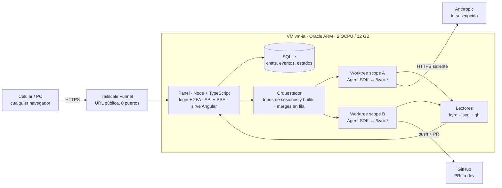

# agents-panel — Plan

_Última actualización: 3 de octubre de 2026 · Miqueas Gentile_

> Fuente de verdad del plan. Los estados de cada worktree están en [`estados.md`](estados.md).

## Resumen y decisiones

La v1 es un panel web que corre en la VM (`vm-ia`, Oracle). Desde ahí se le mandan pedidos a Claude Code, que trabaja con el mismo flujo Kyro de la PC (idea → forge → sprint → QA → `/merge-dev`). Cada scope o work corre en su propio worktree y el resultado son PRs a `dev`: vos las revisás y las aprobás.

| # | Tema | Decisión |
| --- | --- | --- |
| 1 | Motor | Solo Claude Code, vía Claude Agent SDK, con tu suscripción. OpenCode y Pi quedan fuera de la v1. |
| 2 | Acceso | **Tailscale Funnel**: URL pública con HTTPS, sin comprar dominio y sin abrir puertos en la VM. AWS obliga a abrir un puerto público. Cloudflare Tunnel necesita algún dominio con DNS en Cloudflare (no tiene que ser el de NovaGent). Queda para más adelante. |
| 3 | Unidad de trabajo | **1 scope o work de Kyro = 1 worktree.** Las tareas de un sprint corren una tras otra dentro del worktree, y lo que va en paralelo son scopes o works distintos. |
| 4 | Qué muestra la web | Historial de chats, worktrees activos y el estado de cada uno (Planificación → Ejecución → QA → PR a dev, con estado fino). |
| 5 | Impacto en skills | Cambios chicos. El que más se toca es `merge-dev`: pasa de dos máquinas a tres, el `origin` de fe/be pasa a GitHub y las preguntas al usuario van al panel. |
| 6 | Frontend | En la misma VM, servido por el backend. |
| 7 | Stack | Todo TypeScript: backend Node + Fastify + Agent SDK, frontend Angular. |
| 8 | Repo | `agents-panel`, separado de NovaGent. Es multiproyecto: la v1 arranca solo con NovaGent y después se suman Judiciar y otros. |

## Unidad de trabajo: un scope o work = un worktree

La unidad es un scope o un work de Kyro (`.agents/kyro/scopes/` o `.agents/kyro/work/`), no la tarea suelta. Los dos tienen sprints y se ejecutan igual.

- **Kyro ya lo hace así.** `kyro-sprint-executor` corre una tarea por vez y prohíbe paralelizar etapas. Dentro de un sprint, cada tarea depende del estado que dejó la anterior.
- **El scope o work ya define las ramas.** `merge-dev` espera `feature/<scope>` en la raíz y `feature-<scope>` en fe y be.
- **El estado de Kyro queda aislado.** `local.json` (scope activo) está en `.gitignore`, así que cada worktree tiene el suyo. Dos scopes o works no tocan los mismos archivos.

Cómo se arma un worktree en la VM:

1. En la raíz (NovaGent): `git worktree add ~/wt/<proyecto>/<slug> -b feature/<slug>` (el panel lo hace con `execFile`, sin shell; la raíz `~/wt` se cambia con `PANEL_WORKTREES_DIR`). Con varios proyectos la ruta pasó de `~/wt/<scope>` a `~/wt/<proyecto>/<slug>`.
2. Adentro, fe-ventas y be-ventas se clonan en la rama `feature-<scope>` (lógica de `scripts/orca-setup.sh`).
3. Se copian los `.env` de desarrollo de be-ventas y se instalan las dependencias (`go mod download`, `npm install`).
4. Arranca la sesión de Claude Code con `cwd` en el worktree y se corre `/kyro:forge`.

Resuelto con `scripts/panel-setup.sh` (repo `ventas`, ver `vm-setup.md` paso 10). El problema: `orca-setup.sh` clona fe y be desde la copia local, entonces su `origin` apunta a esa carpeta y no a GitHub. Así `merge-dev` no puede pushear ni abrir la PR. En la VM se clona desde GitHub con `--reference` a la copia local, para que siga siendo rápido.

## Varios proyectos y capacidad de la VM

Un proyecto quieto solo ocupa disco. Lo que consume CPU y RAM son los worktrees que trabajan al mismo tiempo. El cupo gratis es **2 OCPU y 12 GB**: Oracle lo redujo a la mitad desde el 15/06/2026 ([InfoQ](https://www.infoq.com/news/2026/07/oracle-cloud-free-tier-limits/)).

No hay un límite contratado de worktrees: es una **configuración del panel**. Cada sesión activa es un proceso de Claude Code, que usa poca RAM. Lo pesado son los builds y tests (`ng build`, `go test`), que compiten por los 2 núcleos.

- **Sesiones en paralelo:** 4 al arrancar (lo mismo que hoy con Orca en una PC de 8 GB). Se puede subir.
- **Builds y tests pesados en paralelo:** 2, con el resto en fila (`en_cola_build`).
- **Swap de 8 GB** como colchón.

| Recurso | VM actual (tope gratis) | Lo consume |
| --- | --- | --- |
| CPU | 2 OCPU | Builds y tests de los worktrees activos |
| RAM | 12 GB + 8 GB de swap | Un proceso de Claude Code por sesión, más cada build (Angular aprox. 3–4 GB, a medir) |
| Disco | 200 GB (tope gratis) | Repos, node_modules y caché de Go por worktree, aprox. 2–5 GB (a medir) |

Lo más probable es que se termine antes el límite de uso de la suscripción que la VM.

**Limpieza al mergear.** Cuando todas las PRs de un scope o work están mergeadas en `dev` y la raíz ya está en `main`, el panel borra el worktree solo:

1. Detecta el merge con `gh pr list --head feature-<scope> --state merged`.
2. Corre `git worktree remove ~/wt/<scope>` y borra las ramas locales `feature/<scope>` y `feature-<scope>`. Las remotas las borra GitHub si está activado "auto-delete head branches".
3. Archiva el chat: queda en el historial como solo lectura.

Si hay cambios sin commitear o una PR cerrada sin mergear, no borra nada y lo marca como `revisar`.

**Registro de proyectos.** Se hace desde el panel, no con un archivo en cada repo: la idea de un `.panel/project.yaml` por proyecto se descartó (el panel guarda la lista en su base y el setup es un comando por proyecto). El usuario pega `owner/repo` o una URL de GitHub en la pantalla **Proyectos** de la web y el panel lo da de alta (`POST /api/projects`, la misma API que usa la web):

- **Solo GitHub.** Entrada validada con `owner/repo` (owner de 1 a 39 caracteres alfanuméricos o guion; repo de hasta 100 con letras, dígitos, punto, guion o guion bajo, sin empezar con punto ni guion). Cualquier otra cosa (otros hosts, `file://`, SSH, credenciales, rutas) se rechaza con 400 antes de ejecutar nada. El clon es `gh repo clone <owner/repo> <destino>` por `execFile`, sin shell, con el `gh` autenticado de la VM.
- **Dónde se clona:** `<PANEL_PROJECTS_DIR>/<nombre>` (por defecto `~/proyectos`, donde ya viven `ventas` y `agents-panel`). El nombre interno es kebab-case, no cambia (se usa en rutas y worktrees) y sale del repo si no se pasa; además hay un **nombre visible** libre y editable (`display_name`).
- **Estados del proyecto:** `cloning` (clonando), `ready` (listo) y `error` (con el motivo en `status_detail`, recortado a 500 caracteres). El clon corre en segundo plano porque uno grande supera un timeout HTTP. Un proyecto pasa a `ready` solo si el clon terminó, su origin es el repo pedido y la rama base existe; si algo falla queda en `error` y se borra la carpeta que creó el panel. Un error se reintenta (`POST /api/projects/:id/retry`). Antes de clonar se exige espacio libre (`PANEL_MIN_FREE_DISK_GB`, por defecto 10); sin espacio queda en `error` «sin espacio». Al arrancar, los proyectos que estaban clonando pasan a `error` «interrumpido». Crear un chat sobre un proyecto que no está `ready` responde 409.
- **Carpeta que ya existe:** se adopta sin clonar si es la raíz de un repo git cuyo origin (https o ssh, con o sin `.git`) es el repo pedido; con otro origin responde 409 y no toca nada. Registrar dos veces el mismo repo responde «ya existe».
- **Setup:** si el repo trae `scripts/panel-setup.sh`, el detalle del proyecto sugiere `bash scripts/panel-setup.sh` (`suggestedSetupCommand`); nunca se aplica solo: el comando se guarda explícito y se edita después (`PATCH /api/projects/:id`).
- **Kyro:** si el repo trae `.agents/kyro/`, al quedar listo se corre `kyro install --scope workspace --init-workspace --yes` en él (hallazgos en `vm-setup.md`, paso 13); si no, el proyecto queda registrado con `hasKyro: false` y un aviso. Una falla de Kyro no revierte el proyecto: queda `ready` con `kyroWarning`.
- `project:add` del CLI sigue sirviendo para registrar una carpeta ya clonada (así se registró `novagent`).
- **Tipos de chat y proyectos sin Kyro:** hay tres tipos: `work`, `scope` y `direct` (**Pedido directo**). `direct` corre en su propio worktree y rama, pero el primer mensaje es el pedido tal cual, sin skill de Kyro. Un proyecto con `hasKyro: false` rechaza `work` y `scope` con 409 (nada se crea) y solo ofrece `direct`; con Kyro se ofrecen los tres. Los chats `direct` también leen el repo (`ls`, `cat`, `head`, `tail`, `wc`, `grep`, `pwd` como inicio de comando, solo con rutas dentro del worktree; sin variables, `~`, comodines, barras invertidas ni comillas dentro de una ruta, y sin opciones que lleven una ruta como `--file=/x`: bash las resolvería distinto de como las valida el panel): el agente nunca corre con `bypassPermissions`.
- **Inicializar Kyro** (`POST /api/projects/:id/kyro-init`, con TOTP): los archivos de Kyro solo llegan a los worktrees nuevos si están commiteados, así que no se instala en el clon base. El panel crea el worktree `<worktrees>/<proyecto>/kyro-init` en la rama `chore/kyro-init` desde la rama base, corre `kyro install --scope workspace --init-workspace --yes` ahí (bajo el mismo `KyroLock` que la actualización) y deja un commit `chore(kyro): inicializar Kyro` **sin pushear**. Las skills de Kyro son globales de la VM y no se copian por proyecto: después de cada `kyro install` del panel (esta acción y el alta de un proyecto con Kyro) se corre `scripts/vm/06-kyro-skills.sh`, que las enlaza en `~/.claude/skills` para que Claude Code las vea. El usuario revisa, pushea y mergea a la rama base; hasta entonces el proyecto sigue sin Kyro. Si algo falla no queda worktree ni rama. Responde 409 si el proyecto ya tiene Kyro, no está `ready`, hay una actualización de Kyro en curso, ya hay una inicialización en curso o ya existe la rama.
- **Traer cambios del clon base** (`POST /api/projects/:id/pull`, sin TOTP: solo avanza, no puede perder trabajo): `git fetch origin` y `git pull --ff-only origin <rama base>` por `execFile`. Responde `{ status: 'updated' | 'up_to_date', before, after, commits, ahead, output }`. Rechaza con 409, sin tocar nada, si el clon está en otra rama que la base, tiene cambios locales en archivos versionados (los no versionados no cuentan), divergió de `origin/<base>`, el proyecto no está `ready` o hay una actualización de Kyro en curso; 502 si git falla (red, origin sin la rama). Los commits locales que GitHub no tiene se conservan y se informan (`ahead`). Los worktrees existentes no se tocan.
- **Borrar un proyecto** (`DELETE /api/projects/:id`, body `{ name, code }`): pide el nombre del proyecto (el visible o el interno) y un TOTP nuevo (se verifica primero). Borra los worktrees (`<worktrees>/<proyecto>`), la carpeta del clon, los chats con sus eventos, los `.env` cifrados y el registro. **No borra nada y responde 409** si hay una sesión corriendo (`running`) o trabajo que existiría solo en la VM (`blockers`: `uncommitted` = cambios sin commitear o archivos nuevos no ignorados; `unpushed` = commits que ningún remoto contiene, incluso en ramas locales o con HEAD suelto), en el clon base, en cada worktree y en los repos anidados un nivel (los repos hijos de ventas). Lo que git ignora (los `.env` del panel) no cuenta. Una carpeta de clon que existe pero no es un repo git se rechaza con 409 (no se puede verificar). Una carpeta de clon que no es un directorio real hijo directo de `PANEL_PROJECTS_DIR` (un symlink, una carpeta adoptada de otro lugar) **no se borra**: se desregistra y se conserva (`cloneRemoved: false`). El registro se borra al final: si algo falla a la mitad responde 500 y el proyecto sigue registrado para reintentar. No toca GitHub. La verificación de «sin pushear» no hace `fetch`: un push hecho desde otra máquina y no traído se ve como pendiente, y se falla del lado seguro.

Los estados del proyecto son distintos de los estados de un worktree (ver [`estados.md`](estados.md)).

**`.env` de desarrollo por proyecto.** Cada proyecto puede tener uno o varios `.env` identificados por ruta relativa (`.env`, `.env.local`, `backend/.env`, `be-ventas/.env.local`…). Se suben, reemplazan y borran por la API (`/api/projects/:id/env`; desde la web, en la Configuración de la página del proyecto) y el panel los escribe en cada worktree nuevo. Un `.env` nunca vuelve al navegador:

- **Cifrado en reposo:** tabla `project_env_files` (`ciphertext`, `iv`, `tag`, `key_names`, `updated_at`, única por proyecto y ruta) con AES-256-GCM. La clave se deriva con HKDF-SHA256 de `PANEL_SECRET_KEY` con info `agents-panel:env-files-v1`, y el AAD es `<projectId>:<ruta>`: un cifrado copiado a otra fila no se descifra. Ni la base ni sus backups tienen el contenido en claro.
- **Solo metadatos hacia afuera:** las respuestas traen ruta, nombres de las claves, fecha y si es legible; nunca el contenido. El logger de Fastify redacta el campo `content` (`LOGGER_OPTIONS` en `apps/api/src/app.ts`, el mismo para `main.ts` y los tests) y un test de punta a punta busca un valor centinela en respuestas, logs, `chat_events` y los archivos de la base.
- **Validaciones (400, sin guardar nada):** ruta relativa con `/`, sin `..`, `.`, segmentos vacíos, `\`, NUL ni `.git`, de hasta 200 caracteres; el archivo se llama `.env` o `.env.<sufijo>` y se rechaza si contiene `prod` o termina en una plantilla (`example`, `sample`, `ejemplo`, `template`). El contenido tiene hasta 64 KB, sin NUL, finales LF o CRLF, y cada línea es vacía, comentario (`#`) o `CLAVE=valor` (con `export ` opcional); los valores multilínea entre comillas no se admiten. Los errores citan la línea por número, nunca su texto. Además git tiene que ignorar la ruta en el clon del proyecto (`git check-ignore`).
- **Re-autenticación:** subir, reemplazar o borrar exige, además de la sesión, un código TOTP vigente que no se haya usado (comparte el paso con el login). Sin código, incorrecto o repetido responde 401 `invalid_totp`, cuenta para el límite de intentos y queda en `login_attempts` con `step = 'reauth'`. No sirven los códigos de recuperación.
- **Escritura en worktrees:** al crear un chat, después del setup (que puede crear las carpetas, como los repos hijos de NovaGent), se escriben todos los `.env` del proyecto con modo 600. Antes de escribir el primero se revalida cada ruta, se exige que la carpeta exista y quede dentro del worktree (sin escaparse por symlinks) y que git la ignore; se escribe en un temporal y se renombra, así un symlink en el destino se reemplaza y no se sigue. Si algo falla, la creación responde 422 con el motivo y se deshace todo (worktree, rama y chat): el agente no arranca sin sus `.env`. El evento del chat registra solo las rutas.
- **Rotar `PANEL_SECRET_KEY`:** los `.env` ya guardados quedan ilegibles (`readable: false`), no se escribe ninguno en worktrees (crear un chat da 422) y hay que volver a subirlos.
- **Aplicar a los activos:** el PUT acepta `applyToActive: true` para escribir el archivo recién guardado en cada worktree activo del proyecto (chat cuyo worktree existe). El resultado viene por worktree (`written` o `skipped` con motivo) y uno que falla no frena a los demás; el guardado queda hecho igual. Un chat con el agente corriendo (`running`) se omite con el motivo «agente en curso: se aplica cuando termine o en el próximo chat»: así el agente no puede cambiar una carpeta por un symlink mientras se escribe (debt-6), sin agregar `O_NOFOLLOW` por carpeta.

**Versiones y actualización de Kyro.** Kyro es global de la VM (CLI en `~/.npm-global/bin/kyro`, runtime en `~/.agents/kyro/current`, skills enlazadas a `~/.claude/skills`), así que se actualiza desde una pantalla propia, no por proyecto. La API:

- `GET /api/versions` → `{ kyro: { installed, latest, updateRunning } }`. `installed` sale de `kyro --version` y `latest` de `npm view kyro-ai version` (ambos por `execFile`, con timeout de 5 s y 10 s). Sin red, con error o con una salida que no es semver el valor es `null` («última: desconocida»); la actualización sigue permitida.
- `POST /api/versions/kyro/update` con `{ "code": "<TOTP>" }`: exige sesión, CSRF y un código TOTP vigente que no se haya usado (mismo `ReauthVerifier` que los `.env`: sin código, incorrecto o repetido responde 401 `invalid_totp` y cuenta para el límite de intentos). Responde **202** `{ runId }` y sigue en segundo plano, o **409** `{ error, running }` si hay sesiones corriendo (con la cantidad) o ya hay otra actualización en curso.
- `GET /api/maintenance-runs?kind=kyro-update` → las últimas 50 corridas, la más nueva primero.
- **Sin sesiones corriendo (L8):** el bloqueo se toma en un solo paso síncrono (`AgentManager.tryBeginMaintenance`): no hay carrera entre «no hay sesiones» y «bloqueo puesto». Mientras dura la actualización, crear un chat o mandar un mensaje responde 409 («Kyro se está actualizando; probá de nuevo cuando termine»); el bloqueo se libera siempre al terminar, bien o mal.
- **Raíces con cambios locales:** la actualización global (`npm i -g kyro-ai@latest`, skills y `kyro doctor`) corre siempre. En cada raíz, si el repo tiene cambios locales (versionados o no) **fuera de `.agents/kyro/`**, el script no corre `kyro update` ahí: la saltea, lo cuenta en su salida y emite una línea `KYRO_SKIPPED=<raíz>` (antes de `KYRO_VERSION`). `GET /api/maintenance-runs` devuelve por corrida `skipped: [raíces]` y la pantalla Versiones lo muestra dentro de esa corrida. Una raíz salteada se actualiza en la próxima corrida, cuando esté limpia.
- **`project.json` modificado:** si el update deja `.agents/kyro/project.json` modificado en el clon, `GET /api/projects` y `/:id` traen `kyroPendingCommit: true` (se calcula al leer con `git status`, no se guarda) y la web muestra en la tarjeta y en la página del proyecto «Kyro actualizado en el clon: hay cambios por commitear». Se commitean con un work o con el botón Commit de un worktree, no a mano sobre el clon base. Esos cambios no bloquean **Traer cambios** (git sigue rechazando el pull si origin toca el mismo archivo), pero sí el **borrado** del proyecto, porque son trabajo sin commitear.
- **Qué corre:** `bash scripts/vm/08-kyro-update.sh <raíces>` por `execFile` (sin shell, timeout de 10 min), con las raíces de los proyectos `ready` que tienen `.agents/kyro/`. La ruta se cambia con `PANEL_KYRO_UPDATE_SCRIPT`. Un `KyroLock` (mutex) serializa la actualización con el `kyro install` del alta de proyectos: nunca se superponen.
- **Historial:** cada corrida es una fila de `maintenance_runs` con versión anterior, versión nueva, `running` / `ok` / `error` y la salida recortada a los últimos 16 KB. La versión nueva es la que se mide con `kyro --version` al terminar (con la línea `KYRO_VERSION=` del script como respaldo), no la pedida. Una corrida que quedó `running` por un reinicio del panel pasa a `error` («interrumpido») al arrancar.
- **H1 verificada (Kyro 6.1.0):** la secuencia correcta es `npm i -g kyro-ai@latest` y después `kyro update --yes` en cada raíz con Kyro; `--yes` no pide nada interactivo. Detalle en `vm-setup.md`, paso 14. La web lo expone en la pantalla **Versiones**.

**Pantallas web del scope `proyectos-y-versiones`.** La web sigue la identidad visual de [`identidad-visual.md`](identidad-visual.md) (Tailwind v4, tokens en un solo archivo, Inter). El header dice «Panel de agentes» y el menú tiene **Proyectos** (pantalla inicial) y **Versiones**.

- **Proyectos (`/`):** una tarjeta por proyecto con nombre visible, la URL completa de GitHub como link con su rama base, y el estado (Clonando / Listo / Error con el motivo) a la derecha del todo; aviso «proyecto sin Kyro» y Reintentar si falló. Se refresca cada 3 s solo mientras haya un clon en curso. El botón **Nuevo proyecto** abre un modal con el alta: pide la URL completa `https://github.com/usuario/repo` (con `/tree/<rama>` opcional, de donde sale la rama base), la valida en el cliente con la misma regla que la API (que sigue siendo la autoridad) y muestra el 400/409 del servidor dentro del modal sin borrar lo escrito. Cuando un proyecto queda listo sin setup guardado y el repo trae `scripts/panel-setup.sh`, la tarjeta muestra el setup sugerido con Confirmar / Editar / Sin setup: nada se guarda hasta confirmar.
- **Proyecto (`/projects/:id`):** un layout con un riel lateral **Chats** / **Configuración**. Sin hijo, abre el último chat elegido de ese proyecto (se recuerda por proyecto en el navegador, con la app funcionando igual si no hay almacenamiento) o, si no hay, **Nuevo chat**. Un id que no existe muestra «Proyecto no encontrado». El proyecto se relee cada 3 s mientras clona.
  - **Chats (`/projects/:id/chats`):** a la izquierda, arriba el botón **Nuevo chat** y debajo los chats del proyecto (`GET /api/chats?projectId=`) con título, `work|scope|directo · rama` y estado; el elegido queda resaltado y la lista se recarga al navegar y cada 4 s mientras haya un agente corriendo. `chats/new` es el formulario de nuevo chat con el proyecto fijo (deshabilitado con el motivo si no está listo; el servidor responde 409 igual); el selector de tipo ofrece Work, Scope y Pedido directo con Kyro y solo Pedido directo sin él, con un aviso y un enlace a Inicializar Kyro y `chats/:chatId` la conversación, con el streaming de siempre. `/chats/:id` sigue funcionando y redirige a su proyecto. Estado fino, fase y «te toca actuar» en la lista son del plan de ejecución automática, no de este scope.
  - **Configuración (`/projects/:id/settings/:tab`):** una pestaña a la vez, con la activa en la URL: **General** (nombre visible, rama base y comando de setup, y debajo la **zona de peligro** con Borrar proyecto: un modal que pide escribir el nombre y un código TOTP, y que lista los bloqueos si se rechaza), **Environment** (los `.env`) y **Repositorio** (Traer cambios de GitHub, que muestra el resultado o el motivo del rechazo, e Inicializar Kyro con modal TOTP, que muestra la rama creada). Agregar una pestaña es sumar una entrada en `settings-tabs.ts` y su caso en `settings.page.ts`.
- **`.env` en la web (pestaña Environment):** solo escritura. Se lista ruta, claves y fecha (o «ilegible», para volver a subirlo); se sube un archivo o texto pegado, se reemplaza subiendo a la misma ruta y se borra con confirmación. Cada acción pide un código TOTP nuevo en un **modal** (`TotpModal`: input de 6 dígitos, Enviar y cruz para cerrar) que no guarda el código: se vacía al enviar y al cerrar. Un 401 `invalid_totp` se muestra dentro del modal, que sigue abierto. El contenido vive solo en el formulario hasta enviarse y se descarta después; si el código fue incorrecto no se guardó nada y se conserva el borrador para reintentar solo con el código. Con «aplicar a los worktrees activos» se ve el resultado por worktree.
- **Versiones (`/versions`):** Kyro instalada y última publicada («última: desconocida» sin red). Actualizar es un icono de refresh (con `aria-label`) que abre el modal TOTP; gira y se deshabilita mientras dura la actualización; el 409 con la cantidad de sesiones corriendo se ve dentro del modal. La pantalla se refresca cada 3 s mientras actualiza y el historial muestra la salida desplegable.
- **Sesión vencida vs. código incorrecto:** un 401 `unauthorized` lleva al login; un 401 `invalid_totp` se queda en la pantalla con «Código incorrecto o ya usado».

**Estructura del repo:** `apps/api` (Fastify + Agent SDK), `apps/web` (Angular), `packages/shared` (tipos compartidos).

## Funcionalidades del panel

**Chats** (como claude.ai)

- Lista de conversaciones con título, proyecto, scope, fecha y estado.
- Abrir una conversación muestra todo lo que pasó, incluidas las herramientas que usó el agente, y se puede seguir (`resume` con el `sessionId`).
- Un chat nuevo puede ser una **consulta libre** (sin worktree, solo lectura sobre `main`) o una **feature nueva**, que crea el scope o work y su worktree.
- Estos chats viven en la base del panel, no en el historial de la app de Claude.

**Worktrees activos**

- Una tarjeta por scope o work: proyecto, ramas, fase, **estado fino** con detalle (ver [`estados.md`](estados.md)), tarea n/m, último evento.
- Marca clara cuando **te toca actuar**: aclaración, permiso, aprobación de plan o de cierre, PR lista.
- Acciones: abrir el chat, pausar, cancelar, reanudar.

**Progreso por fase**

| Fase | De dónde sale |
| --- | --- |
| Planificación | `kyro context-pack --json` (`nextAction`: `plan_sprint`, `clarify`; en un Work, `kyro work status --json`: `plan_tasks`) |
| Ejecución | `nextAction`: `execute_task`, `review_task` (en un Work también `resolve_blocker`); avance = tareas con review `pass` / total |
| QA y cierre | `/kyro:qa`; `nextAction`: `qa_or_close` (en un Work, `ready_to_close`). Después del cierre, `plan_sprint` o `await_scope_completion` |
| PR a dev | `gh pr list --head feature-<scope> --json url,state,statusCheckRollup` |

Campos confirmados en la VM con Kyro 6.1.0 (05/10/2026, scope `autopiloto-kyro`, T1.2). Las fixtures reales están en `apps/api/test/fixtures/kyro/` (se regeneran con `capture.sh`) y las lee `apps/api/src/kyro/state.ts`; ver el detalle en [`estados.md`](estados.md#campos-reales-de-kyro-confirmados-en-la-vm).

## Arquitectura



- **Backend Node + TypeScript** (Fastify). Se autentica con tu suscripción mediante `claude setup-token`.
- **Una sesión por scope o work:** `query()` del SDK con `cwd` en el worktree y `settingSources: ['project', 'user']` (carga `CLAUDE.md`, `.claude/agents` y las skills, incluidas las `kyro-*`). `permissionMode: 'acceptEdits'` más una lista de comandos permitidos (git, gh, go, npm, kyro).
- **Permisos y preguntas:** las herramientas fuera de la lista se deniegan y quedan como evento `permission_denied` (aprobar con botones es de la etapa 5). Las **preguntas del agente** (`AskUserQuestion`) sí llegan al panel: se guardan en `pending_questions`, se responden desde la web con botones o texto libre y la respuesta vuelve a la misma sesión por `updatedInput` (detalle en la etapa 4; estado `esperando_respuesta` en [`estados.md`](estados.md)).
- **Hooks** `PreToolUse` / `PostToolUse`: clasifican los comandos para el estado fino y hacen esperar los builds en el semáforo.
- **Eventos:** cada mensaje del SDK se guarda en SQLite y se manda por SSE.
- **Frontend Angular** (standalone + signals). Lo compila y sirve el backend.
- **SQLite con `node:sqlite`** (módulo nativo de Node 24, `DatabaseSync`): evita módulos nativos de compilación en ARM. WAL y `foreign_keys=ON` siempre activos; migraciones numeradas en código (`apps/api/src/db/migrations.ts`, tabla `schema_migrations`).
- **Ubicación de la base:** fuera del repo, en `PANEL_DATA_DIR` (por defecto `~/.local/share/agents-panel`, archivo `panel.sqlite`, directorio con permisos 0700). Configuración por entorno en `apps/api/src/config.ts`; si falta `PANEL_SECRET_KEY` (mínimo 32 bytes) o `PANEL_ORIGIN`, el proceso no arranca y nunca imprime valores secretos.

## Acceso y despliegue

Se publica con **Tailscale Funnel**. Entrás desde cualquier navegador a `https://vm-ia.<tu-red>.ts.net`, sin instalar nada en la PC ni en el celular. La VM no abre ningún puerto.

| Opción | Qué se instala | URL | Puertos abiertos | Veredicto |
| --- | --- | --- | --- | --- |
| **Tailscale Funnel** | Tailscale solo en la VM | `https://vm-ia.<tu-red>.ts.net` | Ninguno | **v1** |
| Cloudflare Tunnel + Access | `cloudflared` solo en la VM | Dominio tuyo con DNS en Cloudflare | Ninguno | Más adelante, si querés dominio propio |
| Tailscale privado | Tailscale en VM, PC y celular | Solo tus dispositivos | Ninguno | Descartada: obliga a instalar apps |
| AWS (API Gateway / CloudFront) | — | Dominio en AWS | 443 abierto | Descartada |

**Cómo funciona Funnel:** Tailscale en la VM abre una conexión saliente. Los servidores de Tailscale pasan el tráfico cifrado a la VM y el TLS se resuelve en la propia VM. Requisitos: MagicDNS y certificados HTTPS activados, y el atributo `funnel` en la política de acceso. Puertos admitidos: 443, 8443 y 10000. Está en beta y tiene un límite de ancho de banda no configurable ([docs](https://tailscale.com/kb/1223/funnel)).

**Como la URL es pública, el login es la única puerta:**

- Contraseña con hash Argon2id y **segundo factor obligatorio** (passkey o TOTP).
- Sin registro público: el usuario se crea por CLI en la VM.
- Cookie de sesión `HttpOnly`, `Secure`, `SameSite=Strict`, vencimiento corto y protección CSRF.
- Límite de intentos por IP y usuario, bloqueo temporal y registro de logins.
- Cabeceras de seguridad (CSP, HSTS). Ninguna ruta de la API sin sesión.

**Servicio:** systemd (`agents-panel.service`), escucha solo en `127.0.0.1:3000`. Funnel lo publica con `tailscale funnel --bg 3000`.

### Allowlist pública de la API

Guard global deny-by-default (`apps/api/src/auth/guard.ts`): toda petición, incluso a rutas inexistentes, devuelve 401 sin sesión válida, salvo las rutas con `config: { public: true }`. La lista pública es exactamente esta y un test recorre las rutas registradas para atrapar rutas nuevas:

| Ruta | Por qué es pública |
| --- | --- |
| `GET /api/health` | Chequeo de salud (no devuelve datos del usuario) |
| `POST /api/auth/login` | Paso 1 del login (contraseña) |
| `POST /api/auth/totp` | Paso 2 del login (segundo factor; exige la cookie de desafío) |

Sesión: cookie `__Host-panel_session` (HttpOnly, Secure, SameSite=Strict, Path=/), token opaco de 32 bytes; en la base solo su SHA-256. Vence a los 30 min de inactividad o a las 12 h absolutas (configurable).

## Impacto en las skills actuales de NovaGent

| Pieza | ¿Cambia? | Qué hacer |
| --- | --- | --- |
| `merge-dev` | Sí, poco | (1) Tres máquinas: PC, VM y la otra; `pull --no-rebase` y nunca `--force`. (2) `origin` de fe/be = GitHub. (3) "Restaurar rama" no aplica en worktree. (4) Los casos que frenan llegan al panel como "esperando tu respuesta". |
| Merge de la raíz a `main` | Sí (panel) | El panel serializa los merges de la raíz (`en_cola_merge_raiz`). |
| `orca.yaml` + `orca-setup.sh` | Sí | En la VM, el panel usa una versión que recibe el scope, nombra ramas `feature-<scope>` y clona desde GitHub con `--reference`. |
| Kyro (`kyro-ai`) | Sí: pasa a v6 | `npm i -g kyro-ai@latest` + `kyro install --agent claude`. En v6 el plugin de Claude Code se retiró: el CLI proyecta las skills `kyro-*` en `~/.claude/skills/`. La v6 trae los arreglos de Windows, así que los parches de `KYRO_README.md` dejan de hacer falta. |
| Stubs `kyro-forge`, `kyro-qa` y plugin `kyro-ai` | Se retiran | Con v6 se usan las skills que proyecta `kyro install --agent claude`. Desinstalar el plugin viejo después de verificar. |
| `kyro-sprint-executor` | No | Solo necesita el CLI `kyro`. |
| `git-committer` (`~/.claude/agents/`) | Copiar | Está solo en tu PC. |
| `.opencode/skills/git-commit` | Mover (opcional) | `merge-dev` lo lee; conviene llevarlo a `.claude/skills/`. |

## Etapas de implementación

1. ✅ **Preparar la VM** (cerrada el 03/10/2026, ver [`vm-setup.md`](vm-setup.md)). Node, Go (versión de `go.mod`), `gh`, Kyro 6, Claude Code + `kyro install --agent claude`, `git-committer`, swap. Clonar NovaGent con fe y be, `.env` de desarrollo. _Listo cuando:_ `kyro doctor`, `go test ./...` y el build de `client` pasan.
2. ✅ **Probar a mano** (03/10/2026: work `fix-employee-test-redundant-or` lanzado desde el celular con Remote Control, terminó en PR a `dev`. Hizo falta configurar permisos: ver `vm-setup.md` paso 6). Un scope chico de punta a punta con `claude` en `tmux`, en un worktree. _Listo cuando:_ las PRs a `dev` quedan bien y la raíz mergeada a `main`.
3. **Ajustar las skills** de NovaGent (`merge-dev`, script de worktree). _Listo cuando:_ el paso 2 sale sin intervención.
4. **Panel MVP.** Login + 2FA, crear scope (worktree + sesión SDK), streaming, historial y resume. _Estado (04/10/2026):_ implementado en el scope `panel-mvp`, sprint 1; el recorrido de punta a punta de la API se probó en la VM (ver `vm-setup.md` paso 10). Falta confirmar las pantallas en un navegador. Decisiones del sprint:
   - **Segundo factor = TOTP** con 10 códigos de recuperación; passkey queda para después. Los usuarios se crean solo por CLI.
   - **Permisos del agente:** `acceptEdits` + `allowedTools` para `Bash(git|gh|npm|go|kyro)`; `canUseTool` niega lo demás (escritura solo dentro del worktree, lectura del worktree y `~/.agents`) y lo guarda como evento `permission_denied`. Nunca modo sin permisos. Aprobar con botones es de la etapa 5.
   - **Tope fijo de 4 sesiones** a la vez (la quinta da 409); el tope configurable es de la etapa 6.
   - **Kyro en la sesión:** el SDK no registra `/kyro:forge` ni `/kyro:work` en la VM (ver deuda), así que el primer mensaje manda al agente a leer la skill `kyro-forge` o `kyro-work` de `~/.agents/skills`. Instalar las skills para Claude (`kyro install --agent claude`) permitiría usar los comandos directos.
   - **Preguntas del agente desde la web (05/10/2026, scope `autopiloto-kyro`, sprint 1 `preguntas-web`; plan en [`.agents/kyro/plan/2026-10-04-autopiloto-kyro.md`](../.agents/kyro/plan/2026-10-04-autopiloto-kyro.md)):** el agente puede preguntar y vos respondés desde el chat. `AskUserQuestion` pasa el hook `PreToolUse` sin decidir y `AgentManager` la resuelve en `canUseTool`: guarda la pregunta (`pending_questions`, migración 7), publica `question_asked`, espera **sin timeout ni respuesta automática** (L5) y devuelve la respuesta como `updatedInput` (método confirmado por el spike H1, abajo). Rutas `GET /api/chats/:id/questions` y `POST /api/chats/:id/questions/:qid/answer` (404 si la pregunta no es del chat, 409 si ya fue respondida o cancelada, 400 si no coincide con las opciones; `answered_by` es el usuario de la sesión). Las dos exigen sesión y CSRF y **la allowlist pública no cambia**. Cancelar el trabajo, terminar el turno o reiniciar el panel cancelan lo pendiente. La web muestra la tarjeta con un botón por opción y «Otra respuesta». Los spikes de abajo son el respaldo de estas decisiones; los campos reales de Kyro están en [`estados.md`](estados.md#campos-reales-de-kyro-confirmados-en-la-vm).
   - **Spike H1 (05/10/2026, scope `autopiloto-kyro`, SDK 0.3.289):** `apps/api/scripts/spike-ask-question.ts` confirma en la VM que el agente puede preguntar con `AskUserQuestion` y que la respuesta vuelve a la misma sesión por **`updatedInput`** de `canUseTool` (`{ ...input, answers: { <texto de la pregunta>: <respuesta> } }`), con el hook `PreToolUse` dejando pasar la herramienta (devuelve `{}`, no deniega). La alternativa (denegar con `el usuario respondió: …`) también funciona, pero queda solo como respaldo: el método elegido es `updatedInput`. Además `model` en `query()` se respeta: `system:init` informó `claude-opus-5-5` y `claude-sonnet-5-5` según lo pedido.
   - **Spike H2 (05/10/2026, scope `autopiloto-kyro`, SDK 0.3.289, modelo `claude-sonnet-5-5`):** `apps/api/scripts/spike-forge-policy.ts` abre en un repo temporal una sesión real con el primer prompt del panel (`buildInitialPrompt('scope', …)`: leer la skill `kyro-forge`), los permisos reales del panel (`acceptEdits` + `decide()`) y la política de abajo. **Resultado: confirmada.** En 15 turnos el agente leyó la skill y `forge.md`, pidió el `context-pack`, ejecutó la tarea (`hola.txt`), corrió la validación, registró evidencia con `kyro record-evidence`, hizo el review con `kyro review --verdict pass --yes` y se detuvo en `qa_or_close` (`context-pack` final) sin llamar nunca a `AskUserQuestion`. No se usó `kyro-sprint-executor` ni `bypassPermissions`.
     - **Gates que preguntaron:** ninguno en el tramo ejecución → `qa_or_close`. Los gates de **QA, cierre de sprint, reglas globales y scope completo no se ejercitaron** (la política manda parar en `qa_or_close`): se prueban en el sprint 3 con el orquestador, y R16 sigue exigiendo que un gate no cubierto termine en pregunta.
     - **Control sin política** (mismo prompt, sin el bloque de política): tampoco preguntó, pero ejecutó, registró la evidencia y **se detuvo en `review_task`** diciendo que faltaba el review. O sea, lo que la política agrega de verdad es la **autorización a hacer el review en la misma sesión** y la orden de **parar en `qa_or_close`** en lugar de ofrecer QA o cierre. Para el sprint 3: la política tiene que decir explícitamente quién hace el review.
     - **Llamadas que la política de permisos del panel denegó** (el agente se adaptó solo, sin bloquearse): `cat ~/…` (la `~` no se admite en comandos de lectura), redirecciones (`>`, `2>&1` con otro destino) y `echo`. Conviene que la política le pida usar rutas absolutas y no encadenar con `echo`. Además el agente corrió `kyro repair integrity prepare` por su cuenta (es solo vista previa); la política del sprint 3 debe prohibir `kyro repair … apply` (R20: la reparación no se aplica sola).
     - **Salidas de `context-pack` observadas:** `execute_task` al arrancar (sprint planificado con una tarea) y `qa_or_close` al terminar; con el control, `review_task` tras el `record-evidence`. Coinciden con las fixtures de `estados.md`.
     - **Texto de política probado** (va como bloque al final del primer prompt; está en `POLICY_DRAFT` del script):

       ```text
       Autopilot policy (the user pre-approved the routine Kyro gates; follow it instead of asking):
       - Work only on the next task that "kyro context-pack --kyro-scope <scope> --json" routes. Follow its nextAction.
       - Execute the task, run its validations, record evidence with "kyro record-evidence" and review with "kyro review" through the CLI. Never edit sprint.json or any Kyro state by hand.
       - Do NOT ask the user for confirmation at routine gates. Do not ask which task to do, whether to review, or whether to continue.
       - When nextAction is qa_or_close: stop here and report it. Do not close the sprint and do not run QA in this session.
       - Ask the user (AskUserQuestion) only for a material product decision, a cost, or when Kyro reports clarify or a blocker you cannot resolve. Never guess on those.
       - Do not commit and do not push. Never use sudo, ssh, oci, tailscale or terraform.
       ```
   - **Modelos por rol y permisos por proyecto (05/10/2026, scope `autopiloto-kyro`, sprint 2 `modelos-estado-permisos`).**
     - **Modelos:** cada trabajo usa un modelo **pensante** (idea, plan, plan de cada sprint) y uno **ejecutor** (ejecución, QA, correcciones, cierre). Catálogo por proveedor en `packages/shared` (`MODEL_CATALOG`; hoy solo `claude`: `claude-opus-5-5`, `claude-sonnet-5-5`, `claude-fable-5-1`, `claude-haiku-4-5-20251001`) y defecto global pensante `claude-opus-5-5` / ejecutor `claude-sonnet-5-5`. La configuración del proyecto (`GET`/`PUT /api/projects/:id/models`, con sesión y CSRF, sin TOTP porque no expone secretos ni cambia costos) guarda proveedor y modelos; `NULL` significa «el defecto». `POST /api/chats` acepta `models: { thinker?, executor? }`. Al crear el chat se **resuelven y se guardan** (override del chat > proyecto > defecto) en `chats.provider/thinker_model/executor_model`, así que cambiar el proyecto después no mueve un trabajo en curso. Un modelo o proveedor fuera del catálogo da 400 y no guarda nada. La pestaña Modelos y el selector del chat nuevo son del sprint 5.
     - **Sesión por rol:** `AgentRunner.run` recibe `model` y `role`; `SdkRunner` arma las opciones en `buildQueryOptions` (pura, `permissionMode: 'acceptEdits'`, nunca `bypassPermissions`). `AgentManager.start(chatId, text, { role })` abre una fila de `agent_sessions`, registra `session_started { role, provider, model }` y la cierra con el resultado; `model_mismatch` si `system:init` informa otro modelo. **Regla provisoria de los turnos manuales** hasta que el piloto elija el rol por paso (sprint 3): el primer turno de un chat scope o work (INIT o plan) usa el pensante; los siguientes y los pedidos directos, el ejecutor.
     - **Permisos de Bash por proyecto:** la base (`git`, `gh`, `npm`, `go`, `kyro` y los comandos de lectura con ruta validada) no cambia. Cada proyecto puede sumar **comandos** (nombres simples, sin rutas, espacios ni metacaracteres; nunca uno de la base ni uno denegado) y **hosts de curl** desde `GET`/`PUT /api/projects/:id/permissions` (sesión, CSRF y **TOTP**, porque amplía lo que el agente puede ejecutar). Lista fija de **denegados** que ninguna configuración habilita: `oci`, `tailscale`, `terraform`, `sudo`, `su`, `ssh`, `scp`, `sftp`, `nc`, `ncat`, `socat`, `wget` (protege la regla de costos), más los **envoltorios** que ejecutan el comando que reciben (`bash`, `sh`, `env`, `xargs`, `nohup`, `timeout`, `time`, `watch`…, lista `COMMAND_RUNNERS`): el control solo ve la primera palabra de cada etapa, así que habilitar `env` volvería permitido `env sudo …`. Una configuración vieja que ya los tenga guardados tampoco los habilita. `curl` está siempre en modo restringido y nunca entre los auto-aprobados: solo GET/HEAD, URL `http`/`https` sin credenciales, solo a `localhost`, `127.0.0.1` o un host del proyecto, con una lista cerrada de opciones (sin `-L`, `-d`, `-F`, `-T`, `-X`, `-o`, `-O`, `-K` ni `@archivo`). Las sugerencias salen de los nombres de archivo del clon base (`uv.lock` o `pyproject.toml` → `uv`, `python`, `pytest`; `Makefile` → `make`; `Cargo.toml` → `cargo`) y nunca se aplican solas. El `AgentManager` carga los extras del proyecto en cada turno. Además, la base tiene **reglas por argumento** que cierran los caminos directos de una línea hacia los denegados (`checkBaseArgs`): `npm` deniega `exec`, `x`, `explore`, `edit` y cualquier `script-shell` (flag o `npm config set`); `git` deniega la opción global `-c`, `--config-env` y `--exec-path`, deja `git config` solo de lectura (`--get`, `--get-all`, `--get-regexp`, `--list`, `-l`; sin escrituras ni alias `!`), y deniega `--upload-pack`, `--receive-pack`, `--exec`, URLs `ext::`, `rebase --exec`, `bisect run`, `submodule foreach` y `filter-branch`; `go` deniega `generate`, `-exec`, `-toolexec`, `-vettool` y `go env -w/-u`. Una asignación de variable al principio (`GIT_SSH_COMMAND=… git push`) ya se deniega por primera palabra. Cada denegación explica el motivo para que el agente se adapte, y `npm ci/install/test/run`, `git status/diff/log/add/commit/push/pull/fetch/checkout/switch/branch/worktree`, `go build/test/vet/run`, `gh` y `kyro` siguen permitidos. La lista no es un sandbox: `npm test`, `go run`/`go test` y `python` ejecutan código del repo (el plan lo acepta), pero ya no hay un camino directo de una línea a un denegado fijo. El objetivo de la configuración es que ningún denegado se habilite **por nombre**. La tab Permisos de la web (Configuración del proyecto) se entregó en el sprint 2.
     - **Estado fino y Timeline:** tablas `worktree_state`, `worktree_transitions` y `agent_sessions`, lector de Kyro y mapeo de `nextAction` a estado; el detalle está en [`estados.md`](estados.md) («Cómo lo implementa el panel»).
5. **Estados y PRs.** Estado fino ([`estados.md`](estados.md)), stepper, PRs y checks, aprobaciones con botones.
6. **Operación.** Tailscale Funnel, systemd, backup de SQLite, topes configurables, limpieza automática.
7. **Después de la v1.** Notificaciones push (PWA), consumo por scope, Cloudflare si querés dominio propio, Judiciar.

## Riesgos

- **Límite de uso:** el panel, tus chats y Claude Code en la PC consumen el mismo límite. Anthropic pausó un cambio que daría créditos aparte al Agent SDK y podría retomarlo ([fuente](https://support.claude.com/en/articles/15036540-use-the-agent-sdk-with-your-claude-plan)).
- **CPU y memoria:** con 2 OCPU y 12 GB, los builds van en fila y hay swap. El panel mide RAM y CPU para ajustar topes.
- **Oracle puede reclamar la VM** si pasa 7 días con muy poco uso.
- **Secretos:** en la VM solo `.env` de desarrollo. Nada de credenciales de AWS de producción ni el backup de `EcommerceTable`.
- **El panel ejecuta código:** URL pública → segundo factor obligatorio, límite de intentos y permisos acotados (sin `bypassPermissions`).
- **Conflictos en la raíz:** PC y VM pueden mergear `main` a la vez; se cubre con `pull --no-rebase` y la fila de merges.

**Si se reinicia la VM:** worktrees, base del panel y sesiones de Claude Code (`~/.claude/projects`) están en disco y no se pierden. Lo que estaba corriendo pasa a `interrumpido` y se reanuda con `resume`. Solo se pierde todo si se termina la instancia y se borra el disco; para eso están los push a GitHub y un backup del volumen.

## Pendientes

- [x] Acceso: Tailscale Funnel.
- [x] Stack: todo TypeScript.
- [x] Repo: `agents-panel`.
- [x] Kyro en agents-panel: sí. Work para cambios chicos, Forge (scope) para cada etapa grande.
- [x] Revisar en la VM la salida JSON de `kyro status`, `kyro context-pack` y `kyro work status` para cerrar el mapeo de fases (05/10/2026, ver `estados.md`).
