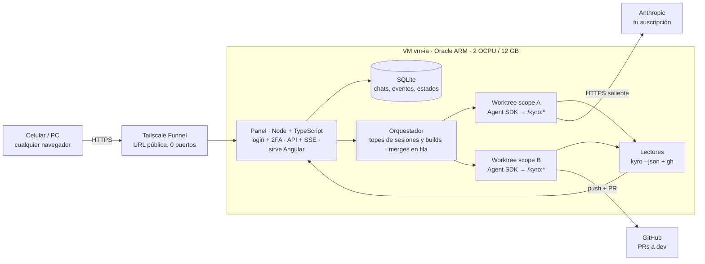

# agents-panel — Plan

_Última actualización: 3 de octubre de 2026 · Miqueas Gentile_

> Fuente de verdad del plan. Los estados de cada worktree están en [`estados.md`](estados.md).

## Resumen y decisiones

La v1 es un panel web que corre en la VM (`vm-ia`, Oracle). Desde ahí se le mandan pedidos a Claude Code, que trabaja con el mismo flujo Kyro de la PC (idea → forge → sprint → QA → `/merge-dev`). Cada scope o work corre en su propio worktree y el resultado son PRs a `dev`: vos las revisás y las aprobás.

| # | Tema | Decisión |
| --- | --- | --- |
| 1 | Motor | Solo Claude Code, vía Claude Agent SDK, con tu suscripción. OpenCode y Pi quedan fuera de la v1. |
| 2 | Acceso | **Tailscale Funnel**: URL pública con HTTPS, sin comprar dominio y sin abrir puertos en la VM. AWS obliga a abrir un puerto público. Cloudflare Tunnel necesita algún dominio con DNS en Cloudflare (no tiene que ser el de NovaGent). Queda para más adelante. |
| 3 | Unidad de trabajo | **1 scope o work de Kyro = 1 worktree.** Las tareas de un sprint corren una tras otra dentro del worktree, y lo que va en paralelo son scopes o works distintos. |
| 4 | Qué muestra la web | Historial de chats, worktrees activos y el estado de cada uno (Planificación → Ejecución → QA → PR a dev, con estado fino). |
| 5 | Impacto en skills | Cambios chicos. El que más se toca es `merge-dev`: pasa de dos máquinas a tres, el `origin` de fe/be pasa a GitHub y las preguntas al usuario van al panel. |
| 6 | Frontend | En la misma VM, servido por el backend. |
| 7 | Stack | Todo TypeScript: backend Node + Fastify + Agent SDK, frontend Angular. |
| 8 | Repo | `agents-panel`, separado de NovaGent. Es multiproyecto: la v1 arranca solo con NovaGent y después se suman Judiciar y otros. |

## Unidad de trabajo: un scope o work = un worktree

La unidad es un scope o un work de Kyro (`.agents/kyro/scopes/` o `.agents/kyro/work/`), no la tarea suelta. Los dos tienen sprints y se ejecutan igual.

- **Kyro ya lo hace así.** `kyro-sprint-executor` corre una tarea por vez y prohíbe paralelizar etapas. Dentro de un sprint, cada tarea depende del estado que dejó la anterior.
- **El scope o work ya define las ramas.** `merge-dev` espera `feature/<scope>` en la raíz y `feature-<scope>` en fe y be.
- **El estado de Kyro queda aislado.** `local.json` (scope activo) está en `.gitignore`, así que cada worktree tiene el suyo. Dos scopes o works no tocan los mismos archivos.

Cómo se arma un worktree en la VM:

1. En la raíz (NovaGent): `git worktree add ~/wt/<proyecto>/<slug> -b feature/<slug>` (el panel lo hace con `execFile`, sin shell; la raíz `~/wt` se cambia con `PANEL_WORKTREES_DIR`). Con varios proyectos la ruta pasó de `~/wt/<scope>` a `~/wt/<proyecto>/<slug>`.
2. Adentro, fe-ventas y be-ventas se clonan en la rama `feature-<scope>` (lógica de `scripts/orca-setup.sh`).
3. Se copian los `.env` de desarrollo de be-ventas y se instalan las dependencias (`go mod download`, `npm install`).
4. Arranca la sesión de Claude Code con `cwd` en el worktree y se corre `/kyro:forge`.

Resuelto con `scripts/panel-setup.sh` (repo `ventas`, ver `vm-setup.md` paso 10). El problema: `orca-setup.sh` clona fe y be desde la copia local, entonces su `origin` apunta a esa carpeta y no a GitHub. Así `merge-dev` no puede pushear ni abrir la PR. En la VM se clona desde GitHub con `--reference` a la copia local, para que siga siendo rápido.

## Varios proyectos y capacidad de la VM

Un proyecto quieto solo ocupa disco. Lo que consume CPU y RAM son los worktrees que trabajan al mismo tiempo. El cupo gratis es **2 OCPU y 12 GB**: Oracle lo redujo a la mitad desde el 15/06/2026 ([InfoQ](https://www.infoq.com/news/2026/07/oracle-cloud-free-tier-limits/)).

No hay un límite contratado de worktrees: es una **configuración del panel**. Cada sesión activa es un proceso de Claude Code, que usa poca RAM. Lo pesado son los builds y tests (`ng build`, `go test`), que compiten por los 2 núcleos.

- **Sesiones en paralelo:** 4 al arrancar (lo mismo que hoy con Orca en una PC de 8 GB). Se puede subir.
- **Builds y tests pesados en paralelo:** 2, con el resto en fila (`en_cola_build`).
- **Swap de 8 GB** como colchón.

| Recurso | VM actual (tope gratis) | Lo consume |
| --- | --- | --- |
| CPU | 2 OCPU | Builds y tests de los worktrees activos |
| RAM | 12 GB + 8 GB de swap | Un proceso de Claude Code por sesión, más cada build (Angular aprox. 3–4 GB, a medir) |
| Disco | 200 GB (tope gratis) | Repos, node_modules y caché de Go por worktree, aprox. 2–5 GB (a medir) |

Lo más probable es que se termine antes el límite de uso de la suscripción que la VM.

**Limpieza al mergear.** Cuando todas las PRs de un scope o work están mergeadas en `dev` y la raíz ya está en `main`, el panel borra el worktree solo:

1. Detecta el merge con `gh pr list --head feature-<scope> --state merged`.
2. Corre `git worktree remove ~/wt/<scope>` y borra las ramas locales `feature/<scope>` y `feature-<scope>`. Las remotas las borra GitHub si está activado "auto-delete head branches".
3. Archiva el chat: queda en el historial como solo lectura.

Si hay cambios sin commitear o una PR cerrada sin mergear, no borra nada y lo marca como `revisar`.

**Registro de proyectos.** Se hace desde el panel, no con un archivo en cada repo: la idea de un `.panel/project.yaml` por proyecto se descartó (el panel guarda la lista en su base y el setup es un comando por proyecto). El usuario pega `owner/repo` o una URL de GitHub y el panel lo da de alta (hoy por la API, `POST /api/projects`; la pantalla web es del sprint 2 del scope `proyectos-y-versiones`):

- **Solo GitHub.** Entrada validada con `owner/repo` (owner de 1 a 39 caracteres alfanuméricos o guion; repo de hasta 100 con letras, dígitos, punto, guion o guion bajo, sin empezar con punto ni guion). Cualquier otra cosa (otros hosts, `file://`, SSH, credenciales, rutas) se rechaza con 400 antes de ejecutar nada. El clon es `gh repo clone <owner/repo> <destino>` por `execFile`, sin shell, con el `gh` autenticado de la VM.
- **Dónde se clona:** `<PANEL_PROJECTS_DIR>/<nombre>` (por defecto `~/proyectos`, donde ya viven `ventas` y `agents-panel`). El nombre interno es kebab-case, no cambia (se usa en rutas y worktrees) y sale del repo si no se pasa; además hay un **nombre visible** libre y editable (`display_name`).
- **Estados del proyecto:** `cloning` (clonando), `ready` (listo) y `error` (con el motivo en `status_detail`, recortado a 500 caracteres). El clon corre en segundo plano porque uno grande supera un timeout HTTP. Un proyecto pasa a `ready` solo si el clon terminó, su origin es el repo pedido y la rama base existe; si algo falla queda en `error` y se borra la carpeta que creó el panel. Un error se reintenta (`POST /api/projects/:id/retry`). Antes de clonar se exige espacio libre (`PANEL_MIN_FREE_DISK_GB`, por defecto 10); sin espacio queda en `error` «sin espacio». Al arrancar, los proyectos que estaban clonando pasan a `error` «interrumpido». Crear un chat sobre un proyecto que no está `ready` responde 409.
- **Carpeta que ya existe:** se adopta sin clonar si es la raíz de un repo git cuyo origin (https o ssh, con o sin `.git`) es el repo pedido; con otro origin responde 409 y no toca nada. Registrar dos veces el mismo repo responde «ya existe».
- **Setup:** si el repo trae `scripts/panel-setup.sh`, el detalle del proyecto sugiere `bash scripts/panel-setup.sh` (`suggestedSetupCommand`); nunca se aplica solo: el comando se guarda explícito y se edita después (`PATCH /api/projects/:id`).
- **Kyro:** si el repo trae `.agents/kyro/`, al quedar listo se corre `kyro install --scope workspace --init-workspace --yes` en él (hallazgos en `vm-setup.md`, paso 13); si no, el proyecto queda registrado con `hasKyro: false` y un aviso. Una falla de Kyro no revierte el proyecto: queda `ready` con `kyroWarning`.
- `project:add` del CLI sigue sirviendo para registrar una carpeta ya clonada (así se registró `novagent`).

Los estados del proyecto son distintos de los estados de un worktree (ver [`estados.md`](estados.md)).

**`.env` de desarrollo por proyecto.** Cada proyecto puede tener uno o varios `.env` identificados por ruta relativa (`.env`, `.env.local`, `backend/.env`, `be-ventas/.env.local`…). Se suben, reemplazan y borran por la API (`/api/projects/:id/env`; la pantalla web es del sprint 4) y el panel los escribe en cada worktree nuevo. Un `.env` nunca vuelve al navegador:

- **Cifrado en reposo:** tabla `project_env_files` (`ciphertext`, `iv`, `tag`, `key_names`, `updated_at`, única por proyecto y ruta) con AES-256-GCM. La clave se deriva con HKDF-SHA256 de `PANEL_SECRET_KEY` con info `agents-panel:env-files-v1`, y el AAD es `<projectId>:<ruta>`: un cifrado copiado a otra fila no se descifra. Ni la base ni sus backups tienen el contenido en claro.
- **Solo metadatos hacia afuera:** las respuestas traen ruta, nombres de las claves, fecha y si es legible; nunca el contenido. El logger de Fastify redacta el campo `content` (`LOGGER_OPTIONS` en `apps/api/src/app.ts`, el mismo para `main.ts` y los tests) y un test de punta a punta busca un valor centinela en respuestas, logs, `chat_events` y los archivos de la base.
- **Validaciones (400, sin guardar nada):** ruta relativa con `/`, sin `..`, `.`, segmentos vacíos, `\`, NUL ni `.git`, de hasta 200 caracteres; el archivo se llama `.env` o `.env.<sufijo>` y se rechaza si contiene `prod` o termina en una plantilla (`example`, `sample`, `ejemplo`, `template`). El contenido tiene hasta 64 KB, sin NUL, finales LF o CRLF, y cada línea es vacía, comentario (`#`) o `CLAVE=valor` (con `export ` opcional); los valores multilínea entre comillas no se admiten. Los errores citan la línea por número, nunca su texto. Además git tiene que ignorar la ruta en el clon del proyecto (`git check-ignore`).
- **Re-autenticación:** subir, reemplazar o borrar exige, además de la sesión, un código TOTP vigente que no se haya usado (comparte el paso con el login). Sin código, incorrecto o repetido responde 401 `invalid_totp`, cuenta para el límite de intentos y queda en `login_attempts` con `step = 'reauth'`. No sirven los códigos de recuperación.
- **Escritura en worktrees:** al crear un chat, después del setup (que puede crear las carpetas, como los repos hijos de NovaGent), se escriben todos los `.env` del proyecto con modo 600. Antes de escribir el primero se revalida cada ruta, se exige que la carpeta exista y quede dentro del worktree (sin escaparse por symlinks) y que git la ignore; se escribe en un temporal y se renombra, así un symlink en el destino se reemplaza y no se sigue. Si algo falla, la creación responde 422 con el motivo y se deshace todo (worktree, rama y chat): el agente no arranca sin sus `.env`. El evento del chat registra solo las rutas.
- **Rotar `PANEL_SECRET_KEY`:** los `.env` ya guardados quedan ilegibles (`readable: false`), no se escribe ninguno en worktrees (crear un chat da 422) y hay que volver a subirlos.
- **Aplicar a los activos:** el PUT acepta `applyToActive: true` para escribir el archivo recién guardado en cada worktree activo del proyecto (chat cuyo worktree existe). El resultado viene por worktree (`written` o `skipped` con motivo) y uno que falla no frena a los demás; el guardado queda hecho igual.

**Versiones y actualización de Kyro.** Kyro es global de la VM (CLI en `~/.npm-global/bin/kyro`, runtime en `~/.agents/kyro/current`, skills enlazadas a `~/.claude/skills`), así que se actualiza desde una pantalla propia, no por proyecto. La API:

- `GET /api/versions` → `{ kyro: { installed, latest, updateRunning } }`. `installed` sale de `kyro --version` y `latest` de `npm view kyro-ai version` (ambos por `execFile`, con timeout de 5 s y 10 s). Sin red, con error o con una salida que no es semver el valor es `null` («última: desconocida»); la actualización sigue permitida.
- `POST /api/versions/kyro/update` con `{ "code": "<TOTP>" }`: exige sesión, CSRF y un código TOTP vigente que no se haya usado (mismo `ReauthVerifier` que los `.env`: sin código, incorrecto o repetido responde 401 `invalid_totp` y cuenta para el límite de intentos). Responde **202** `{ runId }` y sigue en segundo plano, o **409** `{ error, running }` si hay sesiones corriendo (con la cantidad) o ya hay otra actualización en curso.
- `GET /api/maintenance-runs?kind=kyro-update` → las últimas 50 corridas, la más nueva primero.
- **Sin sesiones corriendo (L8):** el bloqueo se toma en un solo paso síncrono (`AgentManager.tryBeginMaintenance`): no hay carrera entre «no hay sesiones» y «bloqueo puesto». Mientras dura la actualización, crear un chat o mandar un mensaje responde 409 («Kyro se está actualizando; probá de nuevo cuando termine»); el bloqueo se libera siempre al terminar, bien o mal.
- **Qué corre:** `bash scripts/vm/08-kyro-update.sh <raíces>` por `execFile` (sin shell, timeout de 10 min), con las raíces de los proyectos `ready` que tienen `.agents/kyro/`. La ruta se cambia con `PANEL_KYRO_UPDATE_SCRIPT`. Un `KyroLock` (mutex) serializa la actualización con el `kyro install` del alta de proyectos: nunca se superponen.
- **Historial:** cada corrida es una fila de `maintenance_runs` con versión anterior, versión nueva, `running` / `ok` / `error` y la salida recortada a los últimos 16 KB. La versión nueva es la que se mide con `kyro --version` al terminar (con la línea `KYRO_VERSION=` del script como respaldo), no la pedida. Una corrida que quedó `running` por un reinicio del panel pasa a `error` («interrumpido») al arrancar.
- **H1 verificada (Kyro 6.1.0):** la secuencia correcta es `npm i -g kyro-ai@latest` y después `kyro update --yes` en cada raíz con Kyro; `--yes` no pide nada interactivo. Detalle en `vm-setup.md`, paso 14. La pantalla web de Versiones llega en el sprint 4.

**Estructura del repo:** `apps/api` (Fastify + Agent SDK), `apps/web` (Angular), `packages/shared` (tipos compartidos).

## Funcionalidades del panel

**Chats** (como claude.ai)

- Lista de conversaciones con título, proyecto, scope, fecha y estado.
- Abrir una conversación muestra todo lo que pasó, incluidas las herramientas que usó el agente, y se puede seguir (`resume` con el `sessionId`).
- Un chat nuevo puede ser una **consulta libre** (sin worktree, solo lectura sobre `main`) o una **feature nueva**, que crea el scope o work y su worktree.
- Estos chats viven en la base del panel, no en el historial de la app de Claude.

**Worktrees activos**

- Una tarjeta por scope o work: proyecto, ramas, fase, **estado fino** con detalle (ver [`estados.md`](estados.md)), tarea n/m, último evento.
- Marca clara cuando **te toca actuar**: aclaración, permiso, aprobación de plan o de cierre, PR lista.
- Acciones: abrir el chat, pausar, cancelar, reanudar.

**Progreso por fase**

| Fase | De dónde sale |
| --- | --- |
| Planificación | `kyro context-pack --json` (`nextAction`: `plan_sprint`, `clarify`) |
| Ejecución | `nextAction`: `execute_task`, `review_task`; avance = tareas con review `pass` / total |
| QA | `/kyro:qa`; `nextAction`: `close_sprint` |
| PR a dev | `gh pr list --head feature-<scope> --json url,state,statusCheckRollup` |

Pendiente: confirmar en la VM los campos exactos de `kyro status --json` y `kyro context-pack --json`.

## Arquitectura

- **Backend Node + TypeScript** (Fastify). Se autentica con tu suscripción mediante `claude setup-token`.
- **Una sesión por scope o work:** `query()` del SDK con `cwd` en el worktree y `settingSources: ['project', 'user']` (carga `CLAUDE.md`, `.claude/agents` y las skills, incluidas las `kyro-*`). `permissionMode: 'acceptEdits'` más una lista de comandos permitidos (git, gh, go, npm, kyro).
- **Permisos y preguntas:** `canUseTool` manda al panel lo que no está permitido y espera tu respuesta.
- **Hooks** `PreToolUse` / `PostToolUse`: clasifican los comandos para el estado fino y hacen esperar los builds en el semáforo.
- **Eventos:** cada mensaje del SDK se guarda en SQLite y se manda por SSE.
- **Frontend Angular** (standalone + signals). Lo compila y sirve el backend.
- **SQLite con `node:sqlite`** (módulo nativo de Node 24, `DatabaseSync`): evita módulos nativos de compilación en ARM. WAL y `foreign_keys=ON` siempre activos; migraciones numeradas en código (`apps/api/src/db/migrations.ts`, tabla `schema_migrations`).
- **Ubicación de la base:** fuera del repo, en `PANEL_DATA_DIR` (por defecto `~/.local/share/agents-panel`, archivo `panel.sqlite`, directorio con permisos 0700). Configuración por entorno en `apps/api/src/config.ts`; si falta `PANEL_SECRET_KEY` (mínimo 32 bytes) o `PANEL_ORIGIN`, el proceso no arranca y nunca imprime valores secretos.

## Acceso y despliegue

Se publica con **Tailscale Funnel**. Entrás desde cualquier navegador a `https://vm-ia.<tu-red>.ts.net`, sin instalar nada en la PC ni en el celular. La VM no abre ningún puerto.

| Opción | Qué se instala | URL | Puertos abiertos | Veredicto |
| --- | --- | --- | --- | --- |
| **Tailscale Funnel** | Tailscale solo en la VM | `https://vm-ia.<tu-red>.ts.net` | Ninguno | **v1** |
| Cloudflare Tunnel + Access | `cloudflared` solo en la VM | Dominio tuyo con DNS en Cloudflare | Ninguno | Más adelante, si querés dominio propio |
| Tailscale privado | Tailscale en VM, PC y celular | Solo tus dispositivos | Ninguno | Descartada: obliga a instalar apps |
| AWS (API Gateway / CloudFront) | — | Dominio en AWS | 443 abierto | Descartada |

**Cómo funciona Funnel:** Tailscale en la VM abre una conexión saliente. Los servidores de Tailscale pasan el tráfico cifrado a la VM y el TLS se resuelve en la propia VM. Requisitos: MagicDNS y certificados HTTPS activados, y el atributo `funnel` en la política de acceso. Puertos admitidos: 443, 8443 y 10000. Está en beta y tiene un límite de ancho de banda no configurable ([docs](https://tailscale.com/kb/1223/funnel)).

**Como la URL es pública, el login es la única puerta:**

- Contraseña con hash Argon2id y **segundo factor obligatorio** (passkey o TOTP).
- Sin registro público: el usuario se crea por CLI en la VM.
- Cookie de sesión `HttpOnly`, `Secure`, `SameSite=Strict`, vencimiento corto y protección CSRF.
- Límite de intentos por IP y usuario, bloqueo temporal y registro de logins.
- Cabeceras de seguridad (CSP, HSTS). Ninguna ruta de la API sin sesión.

**Servicio:** systemd (`agents-panel.service`), escucha solo en `127.0.0.1:3000`. Funnel lo publica con `tailscale funnel --bg 3000`.

### Allowlist pública de la API

Guard global deny-by-default (`apps/api/src/auth/guard.ts`): toda petición, incluso a rutas inexistentes, devuelve 401 sin sesión válida, salvo las rutas con `config: { public: true }`. La lista pública es exactamente esta y un test recorre las rutas registradas para atrapar rutas nuevas:

| Ruta | Por qué es pública |
| --- | --- |
| `GET /api/health` | Chequeo de salud (no devuelve datos del usuario) |
| `POST /api/auth/login` | Paso 1 del login (contraseña) |
| `POST /api/auth/totp` | Paso 2 del login (segundo factor; exige la cookie de desafío) |

Sesión: cookie `__Host-panel_session` (HttpOnly, Secure, SameSite=Strict, Path=/), token opaco de 32 bytes; en la base solo su SHA-256. Vence a los 30 min de inactividad o a las 12 h absolutas (configurable).

## Impacto en las skills actuales de NovaGent

| Pieza | ¿Cambia? | Qué hacer |
| --- | --- | --- |
| `merge-dev` | Sí, poco | (1) Tres máquinas: PC, VM y la otra; `pull --no-rebase` y nunca `--force`. (2) `origin` de fe/be = GitHub. (3) "Restaurar rama" no aplica en worktree. (4) Los casos que frenan llegan al panel como "esperando tu respuesta". |
| Merge de la raíz a `main` | Sí (panel) | El panel serializa los merges de la raíz (`en_cola_merge_raiz`). |
| `orca.yaml` + `orca-setup.sh` | Sí | En la VM, el panel usa una versión que recibe el scope, nombra ramas `feature-<scope>` y clona desde GitHub con `--reference`. |
| Kyro (`kyro-ai`) | Sí: pasa a v6 | `npm i -g kyro-ai@latest` + `kyro install --agent claude`. En v6 el plugin de Claude Code se retiró: el CLI proyecta las skills `kyro-*` en `~/.claude/skills/`. La v6 trae los arreglos de Windows, así que los parches de `KYRO_README.md` dejan de hacer falta. |
| Stubs `kyro-forge`, `kyro-qa` y plugin `kyro-ai` | Se retiran | Con v6 se usan las skills que proyecta `kyro install --agent claude`. Desinstalar el plugin viejo después de verificar. |
| `kyro-sprint-executor` | No | Solo necesita el CLI `kyro`. |
| `git-committer` (`~/.claude/agents/`) | Copiar | Está solo en tu PC. |
| `.opencode/skills/git-commit` | Mover (opcional) | `merge-dev` lo lee; conviene llevarlo a `.claude/skills/`. |

## Etapas de implementación

1. ✅ **Preparar la VM** (cerrada el 03/10/2026, ver [`vm-setup.md`](vm-setup.md)). Node, Go (versión de `go.mod`), `gh`, Kyro 6, Claude Code + `kyro install --agent claude`, `git-committer`, swap. Clonar NovaGent con fe y be, `.env` de desarrollo. _Listo cuando:_ `kyro doctor`, `go test ./...` y el build de `client` pasan.
2. ✅ **Probar a mano** (03/10/2026: work `fix-employee-test-redundant-or` lanzado desde el celular con Remote Control, terminó en PR a `dev`. Hizo falta configurar permisos: ver `vm-setup.md` paso 6). Un scope chico de punta a punta con `claude` en `tmux`, en un worktree. _Listo cuando:_ las PRs a `dev` quedan bien y la raíz mergeada a `main`.
3. **Ajustar las skills** de NovaGent (`merge-dev`, script de worktree). _Listo cuando:_ el paso 2 sale sin intervención.
4. **Panel MVP.** Login + 2FA, crear scope (worktree + sesión SDK), streaming, historial y resume. _Estado (04/10/2026):_ implementado en el scope `panel-mvp`, sprint 1; el recorrido de punta a punta de la API se probó en la VM (ver `vm-setup.md` paso 10). Falta confirmar las pantallas en un navegador. Decisiones del sprint:
   - **Segundo factor = TOTP** con 10 códigos de recuperación; passkey queda para después. Los usuarios se crean solo por CLI.
   - **Permisos del agente:** `acceptEdits` + `allowedTools` para `Bash(git|gh|npm|go|kyro)`; `canUseTool` niega lo demás (escritura solo dentro del worktree, lectura del worktree y `~/.agents`) y lo guarda como evento `permission_denied`. Nunca modo sin permisos. Aprobar con botones es de la etapa 5.
   - **Tope fijo de 4 sesiones** a la vez (la quinta da 409); el tope configurable es de la etapa 6.
   - **Kyro en la sesión:** el SDK no registra `/kyro:forge` ni `/kyro:work` en la VM (ver deuda), así que el primer mensaje manda al agente a leer la skill `kyro-forge` o `kyro-work` de `~/.agents/skills`. Instalar las skills para Claude (`kyro install --agent claude`) permitiría usar los comandos directos.
5. **Estados y PRs.** Estado fino ([`estados.md`](estados.md)), stepper, PRs y checks, aprobaciones con botones.
6. **Operación.** Tailscale Funnel, systemd, backup de SQLite, topes configurables, limpieza automática.
7. **Después de la v1.** Notificaciones push (PWA), consumo por scope, Cloudflare si querés dominio propio, Judiciar.

## Riesgos

- **Límite de uso:** el panel, tus chats y Claude Code en la PC consumen el mismo límite. Anthropic pausó un cambio que daría créditos aparte al Agent SDK y podría retomarlo ([fuente](https://support.claude.com/en/articles/15036540-use-the-agent-sdk-with-your-claude-plan)).
- **CPU y memoria:** con 2 OCPU y 12 GB, los builds van en fila y hay swap. El panel mide RAM y CPU para ajustar topes.
- **Oracle puede reclamar la VM** si pasa 7 días con muy poco uso.
- **Secretos:** en la VM solo `.env` de desarrollo. Nada de credenciales de AWS de producción ni el backup de `EcommerceTable`.
- **El panel ejecuta código:** URL pública → segundo factor obligatorio, límite de intentos y permisos acotados (sin `bypassPermissions`).
- **Conflictos en la raíz:** PC y VM pueden mergear `main` a la vez; se cubre con `pull --no-rebase` y la fila de merges.

**Si se reinicia la VM:** worktrees, base del panel y sesiones de Claude Code (`~/.claude/projects`) están en disco y no se pierden. Lo que estaba corriendo pasa a `interrumpido` y se reanuda con `resume`. Solo se pierde todo si se termina la instancia y se borra el disco; para eso están los push a GitHub y un backup del volumen.

## Pendientes

- [x] Acceso: Tailscale Funnel.
- [x] Stack: todo TypeScript.
- [x] Repo: `agents-panel`.
- [x] Kyro en agents-panel: sí. Work para cambios chicos, Forge (scope) para cada etapa grande.
- [ ] Revisar en la VM la salida JSON de `kyro status` y `kyro context-pack` para cerrar el mapeo de fases.
